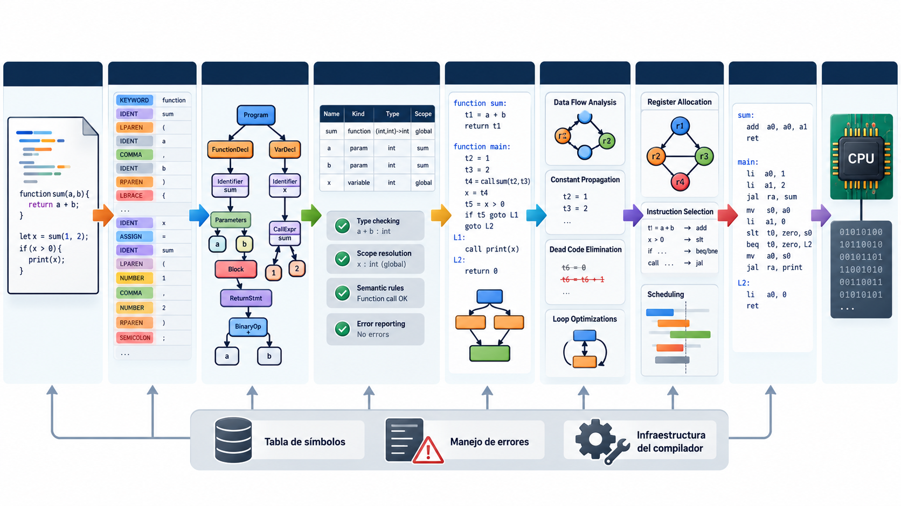

# Procesadores de lenguajes y cadena de traducción

**Módulo 01.**

## Cobertura

Corresponde principalmente a 1.1 y sirve de base para todo el curso.

## Idea central

Un compilador es un transformador semánticamente disciplinado: recibe un programa en un lenguaje fuente y produce una representación objetivo que debe conservar el comportamiento observable permitido por la especificación.

> La imagen resume relaciones; la explicación textual de este capítulo es la fuente principal de estudio.

## Compilar no es “convertir texto”

El programa fuente es texto, pero el significado del programa no vive en los caracteres. La compilación traduce entre **representaciones** progresivamente más explícitas. El lexer descubre unidades léxicas; el parser descubre estructura; el análisis semántico enlaza nombres y comprueba restricciones; el IR explicita operaciones y control de flujo; el backend adapta esas operaciones a una arquitectura concreta.

Conviene separar cuatro clases de procesadores. Un **compilador** traduce antes de ejecutar. Un **intérprete** ejecuta directamente una representación del programa. Un **ensamblador** traduce lenguaje ensamblador a código objeto. Un **linker** combina objetos y resuelve símbolos externos. En una toolchain real también aparecen preprocesadores, loaders, runtimes, depuradores y bibliotecas.

La distinción es conceptual, no absoluta. Una VM puede interpretar bytecode y luego aplicar JIT a regiones calientes. Un compilador puede ejecutar evaluación constante durante la traducción. Lo importante es identificar **cuándo** se decide cada cosa y qué contrato existe entre etapas.

## Corrección y equivalencia observable

La propiedad fundamental es la preservación semántica. Si `P` es un programa fuente válido y `C(P)` su traducción, queremos que ambos exhiban el mismo comportamiento observable bajo el modelo definido: salida, valores retornados, efectos sobre memoria, excepciones permitidas, etc. No significa que ejecuten las mismas instrucciones ni que usen la misma cantidad de memoria.

Esta idea será esencial en optimización. Una transformación puede cambiar radicalmente la forma del programa siempre que respete los comportamientos que la especificación considera visibles. Por eso una optimización depende también de la semántica del lenguaje: reemplazar `x*0` por `0` puede ser ilegal si evaluar `x` produce un efecto lateral que desaparece.

## Ejemplo trabajado

Considere `x = a + b * 2`. El lexer produce tokens; el parser reconoce que `*` tiene mayor precedencia; la semántica confirma que `a`, `b` y `x` existen y tienen tipos compatibles; el IR puede emitir `t1 = b * 2; t2 = a + t1; x = t2`; el backend selecciona instrucciones y registros. La cadena es una serie de decisiones acumulativas, no una traducción palabra por palabra.

## Traslado a implementación

Implemente desde el principio una interfaz por fases. Por ejemplo, `lex(text)->tokens`, `parse(tokens)->ast`, `check(ast)->typed_ast`, `lower(ast)->ir`, `optimize(ir)->ir`, `emit(ir)->asm`. Incluso cuando una fase sea trivial, conservar el límite arquitectónico simplifica pruebas y evolución.

## Errores conceptuales frecuentes

- Confundir compilador con ensamblador.
- Pensar que un lenguaje “compilado” jamás puede ser interpretado.
- Mezclar parsing con resolución de nombres o generación de assembly.

## Ejercicios de dominio

1. Dibuje la toolchain de C desde `.c` hasta proceso en ejecución.
2. Compare AOT, interpretación y JIT en términos de momento de decisión.
3. Defina qué sería “comportamiento observable” para MiniC-RV.

## Preguntas de control

- ¿Qué representación entra a esta fase?
- ¿Qué representación sale?
- ¿Qué invariantes deben cumplirse?
- ¿Qué errores se detectan aquí y cuáles pertenecen a otra fase?
- ¿Cómo demostraría que una transformación preserva la semántica?
