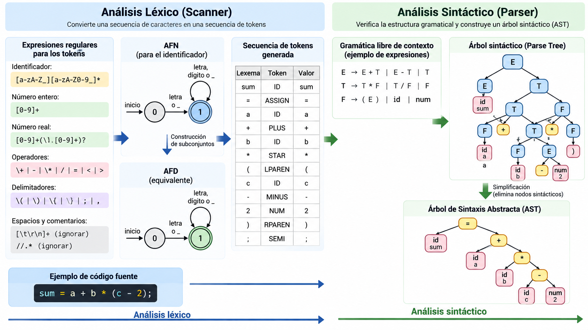

# Módulo 03 — Análisis léxico

**Referencia estructural:** Capítulo 3 de la segunda edición del Dragon Book.

## Competencias del módulo

- Tokens, lexemas, patrones y buffering.
- Expresiones regulares, AFN, AFD y conversión ER→autómata.
- Construcción, generación y optimización de analizadores léxicos.

## Secciones del texto guía cubiertas

3.1 Role; 3.2 Input Buffering; 3.3 Specification of Tokens; 3.4 Recognition; 3.5 Lex; 3.6 Finite Automata; 3.7 Regex to Automata; 3.8 Lexer Generator Design; 3.9 DFA Matcher Optimization.

## Resultado práctico

**Lexer completo**.

## Criterio de dominio

El estudiante debe poder explicar el concepto sin depender del código, derivar el algoritmo sobre un ejemplo pequeño y luego reconocer cómo aparece en el proyecto MiniC-RV.
