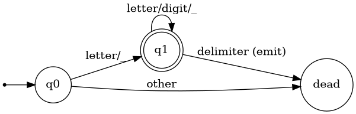

# Expresiones regulares, AFN, AFD y conversión

**Módulo 03.**

## Cobertura

Cubre 3.3, 3.6 y 3.7.

## Idea central

La base teórica del lexer es la equivalencia entre lenguajes regulares, expresiones regulares y autómatas finitos. Esa equivalencia explica cómo una especificación declarativa se convierte en un reconocedor ejecutable.

## Expresiones regulares como álgebra de lenguajes

Una ER se construye con unión, concatenación y cerradura de Kleene. Abreviaturas como `+`, `?` o clases de caracteres se expanden a estas operaciones. La ER describe un conjunto potencialmente infinito de strings pero no tiene memoria no acotada, por lo que no puede expresar estructuras arbitrariamente anidadas como paréntesis balanceados.

## Construcción de Thompson y AFN

La construcción de Thompson crea fragmentos con transiciones epsilon para cada operador de la ER. El resultado es un AFN fácil de construir mecánicamente. Un AFN puede estar conceptualmente en varios estados a la vez; el conjunto alcanzable después de leer un prefijo determina la configuración del reconocimiento.

## Subset construction y AFD

La subset construction transforma conjuntos de estados del AFN en estados del AFD. Se parte de `epsilon-closure(start)`. Para cada símbolo, se calcula `move` y luego un nuevo cierre epsilon. El AFD puede tener hasta `2^n` estados en el peor caso, aunque los lexers prácticos suelen tener muchos menos estados alcanzables. Una vez construido, cada carácter induce una única transición, lo que favorece ejecución rápida.

## Minimización y equivalencia

Estados que no pueden distinguirse por ninguna continuación pueden fusionarse. La minimización no es necesaria para corrección, pero reduce tablas. Más importante pedagógicamente: obliga a razonar sobre el lenguaje residual aceptado desde cada estado.

## Formalización

Si `N` es el conjunto de estados del AFN, cada estado del AFD es un subconjunto `S⊆N`. La transición se define como `Dtran[S,a] = ε-closure(move(S,a))`. Un estado del AFD es de aceptación si contiene al menos un estado final del AFN; si contiene finales de varias reglas, la prioridad del token resuelve cuál se emite.

## Ejemplo trabajado

Para identificadores `[A-Za-z_][A-Za-z0-9_]*`, el AFD mínimo tiene un estado inicial, un estado de aceptación para haber leído el primer carácter válido y un bucle sobre caracteres válidos posteriores. La simplicidad de este ejemplo contrasta con números y comentarios, donde aparecen más estados.

## Traslado a implementación

En el proyecto, construya primero un AFD manual conceptual y luego implemente un scanner directo. Como extensión, construya un mini generador que reciba regex restringidas y emita una tabla de transición.

## Errores conceptuales frecuentes

- Pensar que un AFN “prueba caminos uno por uno”.
- Olvidar epsilon-closure antes y después de `move`.
- Aplicar regex para estructuras que requieren nesting arbitrario.

## Ejercicios de dominio

1. Construya Thompson para `(a|b)*abb`.
2. Ejecute subset construction.
3. Marque estados de aceptación y prioridad.

## Preguntas de control

- ¿Qué representación entra a esta fase?
- ¿Qué representación sale?
- ¿Qué invariantes deben cumplirse?
- ¿Qué errores se detectan aquí y cuáles pertenecen a otra fase?
- ¿Cómo demostraría que una transformación preserva la semántica?

## Visualización complementaria

