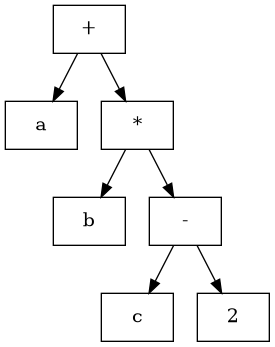

# Módulo 04 — Análisis sintáctico

**Referencia estructural:** Capítulo 4 de la segunda edición del Dragon Book.

## Competencias del módulo

- Gramáticas libres de contexto, ambigüedad y diseño de gramáticas.
- Parsing descendente: FIRST/FOLLOW, LL(1), recursive descent.
- Parsing ascendente: LR, SLR, LALR, conflictos y generadores.

## Secciones del texto guía cubiertas

4.1 Introduction; 4.2 CFG; 4.3 Writing a Grammar; 4.4 Top-Down; 4.5 Bottom-Up; 4.6 SLR; 4.7 LR Parsers; 4.8 Ambiguous Grammars; 4.9 Parser Generators.

## Resultado práctico

**Parser y AST estructural**.

## Criterio de dominio

El estudiante debe poder explicar el concepto sin depender del código, derivar el algoritmo sobre un ejemplo pequeño y luego reconocer cómo aparece en el proyecto MiniC-RV.
