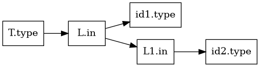

# Definiciones dirigidas por sintaxis y sistemas de atributos

**Módulo 05.**

## Cobertura

Cubre 5.1 y fundamentos de 5.2.

## Idea central

Una SDD extiende la gramática con atributos y ecuaciones semánticas. Es un modelo declarativo para describir cálculos estructurados sobre árboles.

## Atributos sintetizados

Se calculan desde hijos hacia padre y encajan naturalmente con evaluaciones postorder. Ejemplos: valor de una expresión constante, tipo inferido a partir de operandos o código generado concatenando código de hijos. Una S-attributed definition usa solo atributos sintetizados y es particularmente fácil de implementar en parsers bottom-up.

## Atributos heredados

Transportan información de contexto desde padre o hermanos hacia un nodo: tipo declarado que se propaga a una lista de identificadores, entorno de nombres, offset base o etiqueta de salida de un bucle. Permiten expresar cálculos que no dependen exclusivamente de descendientes.

## Grafo de dependencias

Para una instancia concreta del parse tree se crea un nodo por atributo y una arista `x→y` si `y` depende de `x`. Un orden topológico da un orden legal de evaluación. Esta visión permite separar la especificación declarativa de un algoritmo de recorrido concreto.

## Formalización

Una definición es **S-attributed** si todos los atributos son sintetizados. Una definición **L-attributed** restringe cada atributo heredado de un símbolo a depender del padre y de atributos de hermanos situados a su izquierda, permitiendo evaluación en un recorrido depth-first de izquierda a derecha.

## Ejemplo trabajado

Para `T -> int L`, `L.in = int` puede propagar el tipo declarado a cada identificador de la lista. Para `L -> L1 , id`, `L1.in = L.in` y la acción de `id` inserta el símbolo con ese tipo.

## Traslado a implementación

No es obligatorio implementar un motor genérico de atributos. En un compilador manual, los mismos flujos de información aparecen como parámetros de funciones (heredados) y valores retornados (sintetizados). La teoría ayuda a justificar por qué ese recorrido es válido.

## Errores conceptuales frecuentes

- Introducir dependencia circular.
- Depender de un hermano derecho en una definición que se pretende L-attributed.
- Usar variables globales ocultas en lugar de hacer explícito el flujo de información.

## Ejercicios de dominio

1. Dibuje el grafo de dependencias.
2. Clasifique atributos.
3. Determine si una SDD es L-attributed.

## Preguntas de control

- ¿Qué representación entra a esta fase?
- ¿Qué representación sale?
- ¿Qué invariantes deben cumplirse?
- ¿Qué errores se detectan aquí y cuáles pertenecen a otra fase?
- ¿Cómo demostraría que una transformación preserva la semántica?

## Visualización complementaria

