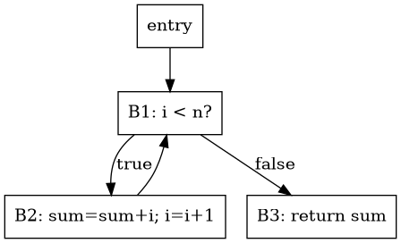

# Expresiones, control de flujo, backpatching y procedimientos

**Módulo 06.**

## Cobertura

Cubre 6.4, 6.6–6.9.

## Idea central

Bajar control estructurado a saltos y bloques es el paso donde el programa comienza a adquirir la forma que necesitarán los análisis y el backend.

## Booleanos: valor frente a control

Una expresión booleana puede materializar `0/1` o generar control directamente. Para `a<b && c<d`, short-circuit exige no evaluar la segunda comparación si la primera es falsa. El jumping code genera ramas cuya estructura respeta esa semántica.

## Backpatching

Cuando se emite un salto antes de conocer su destino se mantiene una lista de posiciones pendientes. Operaciones `makelist`, `merge` y `backpatch` permiten conectar destinos al descubrir etiquetas posteriores. Es una técnica elegante para generación en una sola pasada y ayuda a entender construcción de CFG.

## Switch

Un `switch` puede bajar a cadena de comparaciones, árbol de búsqueda o jump table. La mejor estrategia depende de densidad y rango de casos, por lo que es un primer ejemplo de decisión de code generation basada en costo.

## Procedimientos y llamadas en IR

El IR necesita límites de función, parámetros, llamada, retorno y, si hay memoria, instrucciones de load/store. Mantenga la calling convention abstracta en IR: asignar argumentos a `a0-a7` es responsabilidad del backend. Sin embargo, conserve información de tipo y firma necesaria para layout.

## Ejemplo trabajado

`while (i<n) { sum=sum+i; i=i+1; }` produce un bloque de cabecera con comparación, un bloque de cuerpo con actualizaciones y una arista de retorno a la cabecera, más bloque de salida. El CFG resultante contiene un ciclo que después será objeto de análisis de loops.

## Traslado a implementación

Introduzca clases `BasicBlock` y `FunctionIR`. Una función contiene bloques terminados exactamente por una instrucción terminadora (`Jump`, `CJump`, `Return`). Esta invariante simplifica todos los pases posteriores.

## Errores conceptuales frecuentes

- Bloques con dos terminadores.
- Fall-through implícito no modelado en CFG.
- Materializar siempre booleanos y perder oportunidades de short-circuit.

## Ejercicios de dominio

1. Baje `if/else` a bloques.
2. Implemente backpatching.
3. Elija estrategia de `switch` según densidad.

## Preguntas de control

- ¿Qué representación entra a esta fase?
- ¿Qué representación sale?
- ¿Qué invariantes deben cumplirse?
- ¿Qué errores se detectan aquí y cuáles pertenecen a otra fase?
- ¿Cómo demostraría que una transformación preserva la semántica?

## Visualización complementaria

