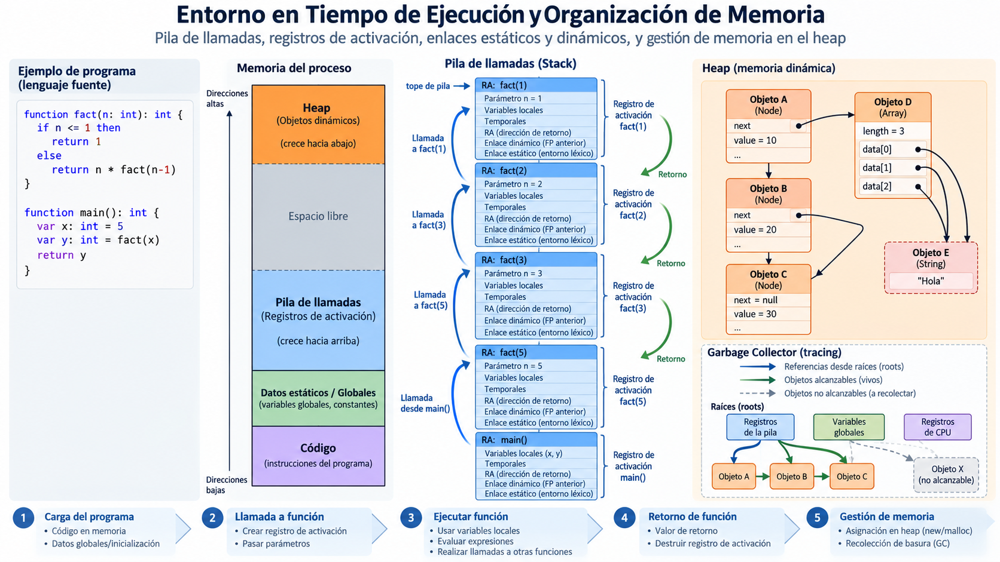
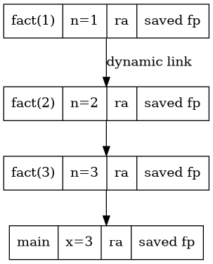

# Módulo 07 — Entornos en tiempo de ejecución

**Referencia estructural:** Capítulo 7 de la segunda edición del Dragon Book.

## Competencias del módulo

- Organización de almacenamiento y registros de activación.
- Acceso a datos no locales y convenciones de llamada.
- Heap, garbage collection y colectores de baja pausa.

## Secciones del texto guía cubiertas

7.1 Storage Organization; 7.2 Stack Allocation; 7.3 Nonlocal Data; 7.4 Heap; 7.5 GC Introduction; 7.6 Trace-Based; 7.7 Short-Pause; 7.8 Advanced GC.

## Resultado práctico

**Runtime y calling convention**.

## Criterio de dominio

El estudiante debe poder explicar el concepto sin depender del código, derivar el algoritmo sobre un ejemplo pequeño y luego reconocer cómo aparece en el proyecto MiniC-RV.
