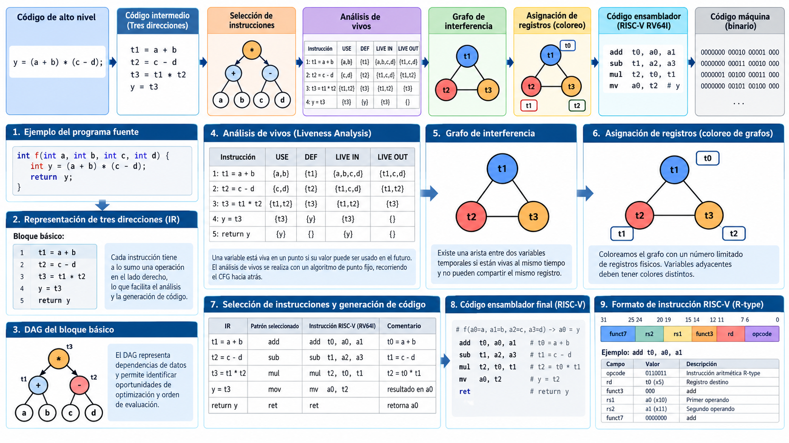

# Módulo 08 — Generación de código objetivo

**Referencia estructural:** Capítulo 8 de la segunda edición del Dragon Book.

## Competencias del módulo

- Máquina objetivo, direcciones, bloques básicos y flow graphs.
- Selección de instrucciones y generación local.
- Liveness, asignación de registros, peephole y encoding RISC-V.

## Secciones del texto guía cubiertas

8.1 Code Generator Design; 8.2 Target Language; 8.3 Addresses; 8.4 Basic Blocks/Flow Graphs; 8.5 Basic-Block Optimization; 8.6 Simple Code Generator; 8.7 Peephole; 8.8 Registers; 8.9 Tree Rewriting; 8.10 Optimal Expressions; 8.11 Dynamic Programming.

## Resultado práctico

**Backend RISC-V y registros**.

## Criterio de dominio

El estudiante debe poder explicar el concepto sin depender del código, derivar el algoritmo sobre un ejemplo pequeño y luego reconocer cómo aparece en el proyecto MiniC-RV.
