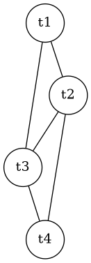

# Liveness, asignación de registros, peephole y código máquina

**Módulo 08.**

## Cobertura

Cubre 8.7, 8.8 y conecta assembly con encoding.

## Idea central

Los temporales virtuales son ilimitados; los registros físicos no. Register allocation decide qué valores residen simultáneamente en qué registros y cuándo deben derramarse a stack.

## Liveness analysis

Un valor está vivo en un punto si su valor actual puede usarse en algún camino futuro antes de redefinirse. Para un bloque, `IN = USE ∪ (OUT - DEF)` y `OUT = ⋃ IN(succ)`. Es un análisis backward de may. La solución global se obtiene por iteración a punto fijo.

## Grafo de interferencia y coloreo

Dos temporales interfieren si están vivos simultáneamente y por lo tanto no pueden compartir registro. Cada temporal es un nodo; una arista representa interferencia. Asignar `K` registros equivale a colorear con `K` colores. El problema general es NP-completo, por lo que compiladores usan heurísticas de simplify, spill, select y coalescing.

## Spilling

Si no hay color disponible, un valor se almacena en un slot de stack y se insertan loads/stores alrededor de usos/defs. Esto cambia el programa e incluso puede aumentar presión temporal, por lo que el allocation suele iterar. La elección de spill considera frecuencia de uso y costo dentro de loops.

## Peephole y encoding

Peephole examina ventanas pequeñas para eliminar movimientos redundantes, jumps a jumps o combinar secuencias. Después, el assembler convierte mnemonics en bits. En RISC-V, instrucciones R-type distribuyen `funct7`, `rs2`, `rs1`, `funct3`, `rd` y `opcode` en campos fijos. Entender el encoding cierra el recorrido fuente→máquina.

## Formalización

Liveness: `IN[B]=USE[B]∪(OUT[B]-DEF[B])`; `OUT[B]=⋃_{S∈succ(B)}IN[S]`. Las ecuaciones son monotónicas sobre un lattice finito de conjuntos, por lo que la iteración alcanza un punto fijo.

## Ejemplo trabajado

Si `t1`, `t2` y `t3` están vivos a la vez y solo hay dos registros disponibles, el grafo contiene un triángulo no 2-coloreable; al menos un temporal debe spillarse. Después del rewrite, se recalcula liveness.

## Traslado a implementación

Genere assembly simbólico primero. Opcionalmente implemente un encoder para un subconjunto RV64I (`add`, `sub`, `addi`, branches) y compare sus palabras con `objdump`. Esta comparación es una prueba excelente del backend.

## Errores conceptuales frecuentes

- Construir interferencia solo por cercanía textual.
- Asignar el mismo registro a valores vivos simultáneamente.
- Confundir pseudo-instrucción `mv` con una instrucción base independiente.

## Ejercicios de dominio

1. Resuelva liveness en un CFG.
2. Coloree un grafo con K=3.
3. Codifique manualmente una instrucción R-type.

## Preguntas de control

- ¿Qué representación entra a esta fase?
- ¿Qué representación sale?
- ¿Qué invariantes deben cumplirse?
- ¿Qué errores se detectan aquí y cuáles pertenecen a otra fase?
- ¿Cómo demostraría que una transformación preserva la semántica?

## Visualización complementaria

