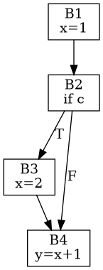

# Fundamentos de análisis de flujo de datos

**Módulo 09.**

## Cobertura

Cubre 9.1–9.3.

## Idea central

El análisis de flujo de datos convierte preguntas globales sobre ejecuciones posibles en sistemas de ecuaciones sobre un CFG que se resuelven por punto fijo.

## Gen/kill y ecuaciones

Muchos análisis resumen el efecto local de un bloque con `GEN` y `KILL`. Reaching definitions es forward-may: `IN[B]=union OUT[pred]`; `OUT[B]=GEN[B]∪(IN[B]-KILL[B])`. Available expressions es forward-must y usa intersección. Liveness es backward-may. Dirección y operador de meet derivan de la pregunta semántica.

## Lattices y monotonicidad

La teoría general usa un lattice de hechos ordenados por precisión/información, funciones de transferencia monotónicas y un operador de meet. En CFG finito con altura finita, una worklist alcanza un punto fijo. Distinguir least/greatest fixed point depende de cómo se define el orden, pero operacionalmente el curso enfatiza inicialización, meet y transferencia.

## Conservadurismo

El compilador debe optimizar solo cuando la propiedad está demostrada para todos los caminos relevantes. Un análisis `may` sobreaproxima posibilidades; un `must` subaproxima garantías. La aparente imprecisión es intencional: sacrifica oportunidades para preservar corrección.

## Ejemplo trabajado

Para reaching definitions, si un bloque tiene dos predecesores y una definición llega por cualquiera de ellos, pertenece a `IN`: por eso el meet es unión. Para available expressions, una expresión debe estar disponible por todos los caminos: por eso el meet es intersección.

## Traslado a implementación

Implemente un motor genérico de worklist con callbacks `transfer` y `meet` solo después de construir dos análisis concretos. La abstracción debe emerger de necesidades repetidas, no precederlas.

## Errores conceptuales frecuentes

- Usar unión donde se necesita una propiedad must.
- Detenerse tras una sola pasada.
- Optimizar con un hecho que es solo posible, no garantizado.

## Ejercicios de dominio

1. Clasifique análisis como forward/backward y may/must.
2. Resuelva reaching definitions.
3. Demuestre terminación informal.

## Preguntas de control

- ¿Qué representación entra a esta fase?
- ¿Qué representación sale?
- ¿Qué invariantes deben cumplirse?
- ¿Qué errores se detectan aquí y cuáles pertenecen a otra fase?
- ¿Cómo demostraría que una transformación preserva la semántica?

## Visualización complementaria

