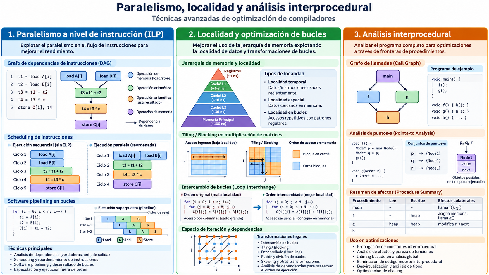

# Módulo 10 — Paralelismo a nivel de instrucción

**Referencia estructural:** Capítulo 10 de la segunda edición del Dragon Book.

## Competencias del módulo

- Arquitectura, latencias y restricciones de scheduling.
- Scheduling de bloques básicos y global.
- Software pipelining y modulo scheduling.

## Secciones del texto guía cubiertas

10.1 Processor Architectures; 10.2 Scheduling Constraints; 10.3 Basic-Block Scheduling; 10.4 Global Scheduling; 10.5 Software Pipelining.

## Resultado práctico

**Scheduler experimental**.

## Criterio de dominio

El estudiante debe poder explicar el concepto sin depender del código, derivar el algoritmo sobre un ejemplo pequeño y luego reconocer cómo aparece en el proyecto MiniC-RV.
