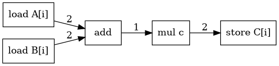

# Arquitectura y restricciones de scheduling

**Módulo 10.**

## Cobertura

Cubre 10.1 y 10.2.

## Idea central

El paralelismo a nivel de instrucción (ILP) busca solapar la ejecución de operaciones independientes. El compilador puede cambiar el orden de las instrucciones siempre que respete dependencias de datos, memoria, control y recursos de la microarquitectura modelada.

## Dependencias verdaderas y dependencias de nombre

Una dependencia **RAW** (read after write) representa flujo real de datos: una instrucción consume el resultado producido por otra. No puede eliminarse mediante simple renaming.

Las dependencias **WAR** (write after read) y **WAW** (write after write) aparecen por reutilizar un mismo nombre de registro o ubicación. En una representación con registros virtuales ilimitados, muchas de estas dependencias pueden desaparecer mediante renaming.

Las dependencias de memoria son más complejas. Dos accesos pueden parecer independientes en el código pero referirse a la misma dirección en runtime. Por eso un scheduler no debe reordenar loads/stores agresivamente sin información suficiente de alias analysis.

## Latencia, throughput y recursos

**Latencia** es el tiempo hasta que un resultado está disponible para una operación dependiente. **Throughput** describe la frecuencia con la que una unidad puede aceptar nuevas operaciones. Una multiplicación podría tener latencia de varios ciclos y, sin embargo, una unidad pipelined podría iniciar una nueva multiplicación cada ciclo.

Además, una CPU tiene recursos finitos: puertos de carga, ALUs, unidades de multiplicación, ancho de emisión, etc. Un schedule legal debe satisfacer simultáneamente las dependencias y la capacidad de recursos por ciclo.

## DAG de dependencias

Para un bloque básico, construya un DAG donde cada nodo sea una instrucción y cada arista indique una restricción de precedencia. Una arista `u -> v` con latencia `L` impone:

```text
start(v) >= start(u) + L
```

Si no existe un camino de dependencia entre dos operaciones, el scheduler puede considerar ejecutarlas en paralelo o reordenarlas, sujeto a recursos y efectos de memoria.



## Ejemplo trabajado

Suponga:

```text
1  t1 = load A[i]
2  t2 = load B[i]
3  t3 = t1 + t2
4  t4 = p * q
5  t5 = t3 * t4
```

Las dos cargas son independientes entre sí. La multiplicación `p*q` tampoco depende de ellas. Si las cargas tienen latencia 2 y la multiplicación latencia 3, ejecutar `p*q` mientras se esperan las cargas puede reducir ciclos ociosos. Sin embargo, `t5` solo puede empezar cuando estén disponibles `t3` y `t4`.

La reordenación legal no surge de observar “líneas separadas”, sino de demostrar ausencia de dependencia entre las operaciones movidas.

## Control y especulación

Mover una operación por encima de un branch puede hacer que se ejecute en un camino donde originalmente no se ejecutaba. Esto solo es seguro si la operación puede especularse: no produce efectos laterales observables ni traps que cambien el comportamiento permitido.

Por ejemplo, mover una división potencial por cero fuera de un bloque condicional puede introducir una excepción en una ejecución que antes no la tenía. Esa transformación es incorrecta salvo que el análisis demuestre que el divisor nunca es cero o que la semántica permita tal especulación.

## Traslado a implementación

Para el laboratorio, modele una máquina pequeña:

```text
issue_width = 2
resources:
  ALU: 2
  MUL: 1
  LOAD: 1
latencies:
  ALU: 1
  MUL: 3
  LOAD: 2
```

El scheduler recibe un DAG y produce un ciclo de inicio para cada instrucción. Mantenga separadas dos funciones:

1. `is_ready(node, cycle)`: verifica dependencias;
2. `resources_available(node, cycle)`: verifica capacidad estructural.

Esto permite distinguir claramente **legalidad semántica** de **factibilidad microarquitectónica**.

## Errores conceptuales frecuentes

- Confundir dependencias WAR/WAW con dependencias verdaderas de datos.
- Reordenar operaciones de memoria sin demostrar no-aliasing.
- Suponer que latencia y throughput son la misma magnitud.
- Evaluar un schedule solo por cantidad de instrucciones y no por ciclos/recursos.
- Ignorar que reordenar puede aumentar la presión de registros.

## Ejercicios de dominio

1. Construya el DAG de un bloque con dos loads, una suma, una multiplicación independiente y un store.
2. Calcule el critical path bajo latencias dadas.
3. Proponga un schedule legal para una máquina de issue width 2.
4. Dé un ejemplo donde un mejor schedule local aumente spilling y empeore el resultado global.

## Preguntas de control

- ¿Qué dependencias puede eliminar register renaming?
- ¿Qué información adicional necesita el scheduler para mover loads/stores?
- ¿Por qué el critical path establece un límite inferior del tiempo de ejecución del bloque bajo el modelo?
- ¿Qué interacción existe entre scheduling y register allocation?
