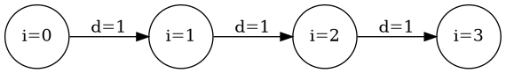

# Módulo 11 — Optimización para paralelismo y localidad

**Referencia estructural:** Capítulo 11 de la segunda edición del Dragon Book.

## Competencias del módulo

- Espacios de iteración, índices afines y dependencias.
- Paralelización, sincronización y pipelining de bucles.
- Localidad, tiling, interchange, fusión y transformaciones afines.

## Secciones del texto guía cubiertas

11.1 Basic Concepts; 11.2 Matrix Multiply; 11.3 Iteration Spaces; 11.4 Affine Indexes; 11.5 Data Reuse; 11.6 Dependence Analysis; 11.7 Parallelism; 11.8 Synchronization; 11.9 Pipelining; 11.10 Locality; 11.11 Affine Transforms.

## Resultado práctico

**Optimizaciones de bucles/localidad**.

## Criterio de dominio

El estudiante debe poder explicar el concepto sin depender del código, derivar el algoritmo sobre un ejemplo pequeño y luego reconocer cómo aparece en el proyecto MiniC-RV.
