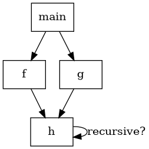

# Motivación, call graph y representación lógica del flujo

**Módulo 12.**

## Cobertura

Cubre 12.1–12.3.

## Idea central

El análisis intraprocedural trata llamadas como fronteras opacas. El análisis interprocedural intenta propagar información a través de esas fronteras para mejorar precisión y habilitar optimizaciones whole-program.

## Call graph

Un call graph tiene funciones como nodos y posibles llamadas como aristas. Las llamadas directas son fáciles; function pointers, virtual dispatch o reflexión pueden volver el grafo conservador. Recursión produce ciclos y sugiere analizar componentes fuertemente conexas.

## Summaries

En lugar de reanalizar el cuerpo para cada caller, una función puede resumirse por efectos: globals leídos/escritos, argumentos que escapan, valores retornados, excepciones, pureza. Resúmenes composicionales escalan mejor y alimentan DCE, LICM, inlining y análisis de alias.

## Relaciones lógicas

Muchos análisis pueden expresarse como hechos y reglas: `Assign(x,y)`, `PointsTo(x,o)`, `Load(x,y,f)`. Un motor de reglas deriva el cierre hasta punto fijo. La representación lógica separa especificación del algoritmo y motiva implementaciones en Datalog.

## Ejemplo trabajado

Si `f` solo lee su argumento y no escribe memoria global, una llamada a `f` dentro de un loop puede ser candidata a movimiento si el argumento es invariante y `f` es total/no trapping según la semántica permitida. Sin summary, el optimizador debe asumir efectos desconocidos.

## Traslado a implementación

Construya call graph para llamadas directas de MiniC-RV. Colapse SCCs y compute summaries bottom-up cuando sea posible; para ciclos use iteración a punto fijo.

## Errores conceptuales frecuentes

- Asumir que el call graph es un árbol.
- Ignorar recursión.
- Marcar función como pura solo porque no escribe globals visibles.

## Ejercicios de dominio

1. Construya SCCs.
2. Defina summary de efectos.
3. Propague pureza.

## Preguntas de control

- ¿Qué representación entra a esta fase?
- ¿Qué representación sale?
- ¿Qué invariantes deben cumplirse?
- ¿Qué errores se detectan aquí y cuáles pertenecen a otra fase?
- ¿Cómo demostraría que una transformación preserva la semántica?

## Visualización complementaria

