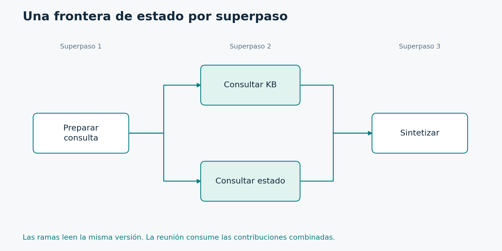

# 1.4. Superpasos, concurrencia y finalización

**Módulo 1: Fundamentos · Dedicación estimada: 10 minutos**

## Qué vas a poder hacer

- Predecir qué versión del estado lee cada rama.
- Diferenciar límites de superpasos y de llamadas al modelo.

**Antes de empezar:** Tópico 1.3.

## La unidad de avance del runtime

La consulta a la base de conocimiento y la consulta de estado trabajan independientemente. La síntesis se programa después de completar la barrera.

[Diagrama editable en Mermaid](../_recursos/superpasos.mmd).

LangGraph ejecuta el grafo mediante superpasos. En cada uno identifica qué nodos están habilitados, ejecuta su trabajo y luego aplica las actualizaciones del estado. Los nodos que pueden correr en paralelo pertenecen al mismo superpaso. Los que dependen del resultado de otros avanzan en superpasos posteriores.

En el diagrama, después de recibir una solicitud se activan dos consultas independientes: base de conocimiento y estado del servicio. Ambas leen la misma versión del estado. Si una termina antes, eso no significa que la otra vea inmediatamente su actualización. Los cambios se consolidan en la frontera correspondiente del runtime.

Después, un nodo de síntesis utiliza los resultados. Si dos ramas escriben el mismo campo, tenemos que definir cómo combinar esas escrituras. Esa es la función de un reducer. Si la clave acepta un único valor y dos nodos la actualizan al mismo tiempo, no deberíamos esperar que gane mágicamente el último. Se produce un conflicto que debemos resolver mediante diseño.

La distinción también importa para los límites. El recursion_limit controla cuántos superpasos puede recorrer una ejecución antes de detenerse con un error de límite. No representa profundidad de la pila de Python ni un número exacto de llamadas al modelo. Una vuelta del agente puede consumir varios superpasos.

## Tres consecuencias para el diseño

1. **Visibilidad:** una rama no debe usar una variable global para comunicar un resultado a otra rama del mismo superpaso. Escribí al estado y ubicá al consumidor después de la reunión.
2. **Conflictos:** dos escritores simultáneos sobre un campo de valor único necesitan un diseño diferente o una regla de combinación. «El último gana» no es un contrato válido para asumir sin más.
3. **Terminación:** alcanzar END en una rama no equivale a cancelar todo trabajo independiente que ya esté habilitado. El recorrido debe tener condiciones de salida coherentes para todas las ramas.

Un ciclo de agente alterna, por ejemplo, agent y tools. Tres llamadas al modelo no equivalen a tres superpasos: hay pasos de herramientas entre llamadas y fronteras del runtime. Por eso el curso mantiene un contador de llamadas de aplicación y un recursion_limit adicional. Uno expresa presupuesto; el otro limita el recorrido.

## Ejercicio de predicción

Partís de results vacío. KB devuelve [A] y status devuelve [B] en paralelo. Si results concatena listas, la reunión obtiene ambas contribuciones. Si una rama intenta leer B antes de terminar su superpaso, no debe dar por hecho que ya estará disponible. Si el resultado se presenta al usuario, ordená explícitamente por fuente o por un criterio de negocio.

### Variante que revela un error

Suponé que ambas ramas escriben summary como cadena sin reducer. El problema no se arregla agregando una espera artificial. Rediseñá las contribuciones como resultados independientes y dejá que un único nodo construya summary después de la reunión.

## Comprobación de comprensión

**Antes de mirar la respuesta:** ¿Aumentar recursion_limit arregla un agente que nunca termina?

### Respuesta razonada

Solo posterga el error y puede aumentar el costo. Primero hay que definir progreso observable, presupuesto y salida. El límite del runtime es una protección adicional, no una condición de éxito del negocio.

## Documentación para profundizar

- [Graph API](https://docs.langchain.com/oss/python/langgraph/graph-api)
- [Implementación con Graph API](https://docs.langchain.com/oss/python/langgraph/use-graph-api)

---

[Índice del módulo](00_inicio_del_modulo.md) · [Índice del curso](../README.md) · [Anterior](../01_Fundamentos/03_estado_nodos_y_aristas.md) · [Siguiente](../01_Fundamentos/05_caso_conductor_asistente_de_soporte.md)
