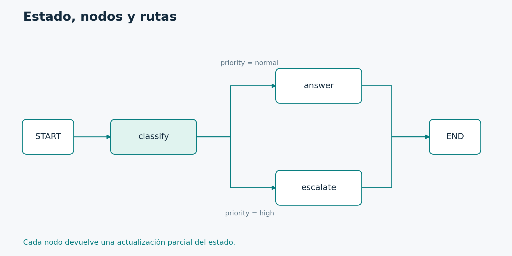

# 2.3. Construcción, rutas condicionales e invocación

**Módulo 2: Graph API · Dedicación estimada: 20 minutos**

## Qué vas a poder hacer

- Registrar nodos y expresar destinos con contratos claros.
- Compilar y comprobar un resultado de Graph API v2.

**Antes de empezar:** Tópico 2.2.

## Constructor y aplicación ejecutable

En este bloque construimos la topología. El objeto builder describe el programa. Todavía no es la aplicación compilada. Esa separación permite registrar nodos, aristas y opciones antes de preparar el runtime.

Cada nodo tiene un nombre y una función. Podríamos elegir nombres diferentes, pero mantenerlos alineados facilita interpretar las trazas. Los nombres también importan cuando conservamos ejecuciones pendientes. Si después cambiamos la topología, debemos pensar qué ocurrirá con los checkpoints existentes.

La arista desde START define la entrada. Aún faltan las salidas de classify. Las agregaremos mediante una función de enrutamiento. La construcción explícita ayuda a comprobar que todo nodo tenga una responsabilidad y una forma de llegar al final.

Compilar prepara y valida aspectos estructurales del grafo. No demuestra que una regla de negocio sea correcta ni que una llamada externa tenga permiso. Por eso necesitamos pruebas sobre datos representativos.

Una pregunta habitual es si hay que crear el grafo cada vez que llega una consulta. Normalmente lo construimos y compilamos durante el arranque del proceso y lo invocamos muchas veces con entradas y contextos distintos. Las conexiones y su ciclo de vida se administran aparte. Esa reutilización evita reconstruir topología para cada mensaje.

```python
builder = StateGraph(TicketState)
builder.add_node("classify", classify)
builder.add_node("answer", answer)
builder.add_node("escalate", escalate)
builder.add_edge(START, "classify")
```

### Lectura del código

Los números corresponden a las líneas del bloque, contando las líneas en blanco.

| Línea | Qué hace y por qué está aquí |
| --- | --- |
| 1 | Creamos un constructor con TicketState como contrato. Todavía no ejecutamos el flujo. |
| 2 | Registramos classify con un nombre que las aristas podrán referenciar. |
| 3 | Registramos answer como nodo separado para la ruta normal. |
| 4 | Registramos escalate para la ruta de derivación. |
| 5 | Establecemos classify como primera ejecución después de START. |

## Decidir por el estado

Aquí se vuelve explícita la diferencia entre calcular un dato y usarlo para elegir un camino. Clasificar escribe priority. Route lee ese valor y devuelve una etiqueta. El mapa traduce la etiqueta a un nodo.

Podríamos devolver directamente un nombre de nodo, pero el mapa separa el vocabulario de negocio del vocabulario de la topología. Si cambia un nombre interno, la prioridad puede seguir siendo la misma.

No agregamos además una arista fija desde classify hacia answer. Esa conexión podría programar trabajo adicional al seleccionado por la ruta condicional. Cuando la decisión debe ser exclusiva, la salida del nodo debe expresar esa exclusividad.

Cada rama llega a END. En un agente habrá un ciclo, pero igualmente necesitaremos una condición de salida verificable. Finalizar significa que ya no queda trabajo programado, no que toda respuesta sea correcta.

La variable triage es la que invocaremos. Observá la secuencia: contrato, funciones, registro de nodos, conexiones y compilación. Este patrón facilita revisar el flujo. Si hay un destino mal escrito, buscamos el registro del nodo y la etiqueta del mapa antes de modificar la lógica de negocio.

```python
def route(s: TicketState):
    return s["priority"]

builder.add_conditional_edges(
    "classify", route,
    {"normal": "answer", "high": "escalate"},
)
builder.add_edge("answer", END)
builder.add_edge("escalate", END)
triage = builder.compile()
```

### Lectura del código

Los números corresponden a las líneas del bloque, contando las líneas en blanco.

| Línea | Qué hace y por qué está aquí |
| --- | --- |
| 1 | route recibe el estado después de clasificar. |
| 2 | Devuelve una etiqueta de ruta, no una actualización del estado. |
| 4 | Registramos aristas condicionales. |
| 5 | Indicamos classify como origen y route como selector. |
| 6 | Traducimos normal y high a nombres de nodos. |
| 7 | Cerramos el registro de las alternativas. |
| 8 | La ruta answer termina en END. |
| 9 | La ruta escalate también termina en END. |
| 10 | Compilamos y guardamos la aplicación ejecutable en triage. |

El mapa relaciona etiquetas lógicas con nombres de nodos. Aquí normal conduce a answer y high a escalate. Si cambiás una etiqueta en classify pero olvidás el mapa, rompés el contrato de enrutamiento. La función route selecciona; no ejecuta la función de destino por su cuenta.

## Invocar y observar

Ya tenemos un primer programa completo. Para esta consulta esperamos high y el texto de derivación. El estado final conservará el texto original porque ninguna actualización lo reemplazó.

Usaremos version igual a v2 en las invocaciones de la clase. En ese formato recibimos GraphOutput y accedemos al estado mediante value. Si encuentran ejemplos que indexan result directamente, revisen qué formato están usando. Mezclar variantes de la API causa errores al copiar código.

Esta aserción verifica una propiedad exacta del flujo. Podemos agregar otro caso para la ruta normal. La utilidad consiste en detectar que una modificación futura de las aristas cambie inadvertidamente la política.

Si invoke falla por una clave ausente, inspeccionen la entrada del primer nodo que la necesita. Si la prioridad es correcta pero la respuesta no, revisen el mapa. Si el resultado tiene otra forma, comprueben versiones y parámetros.

Ejecuten el archivo con el intérprete del entorno. Antes de hacerlo, enumeren los campos que esperan al final. Esa comparación entre anticipación y observación es la base de la depuración. El resultado completo también puede contener información adicional del runtime cuando hay una interrupción, como veremos en el módulo de persistencia.

```python
result = triage.invoke(
    {"text": "Servicio caído"},
    version="v2",
)
print(result.value["priority"])
print(result.value["reply"])
assert result.value["priority"] == "high"
```

### Lectura del código

Los números corresponden a las líneas del bloque, contando las líneas en blanco.

| Línea | Qué hace y por qué está aquí |
| --- | --- |
| 1 | invoke ejecuta hasta finalizar o interrumpirse. |
| 2 | Proporcionamos únicamente el texto inicial. |
| 3 | Seleccionamos explícitamente el formato de salida v2 disponible en la versión del curso. |
| 4 | Recibimos un objeto GraphOutput. |
| 5 | value contiene el estado de salida y allí leemos priority. |
| 6 | Leemos la respuesta final dentro de ese estado. |
| 7 | La aserción comprueba que esta entrada tomó la prioridad esperada. |

[Archivo ejecutable: triage.py](../_laboratorio/triage.py)

## Recorrido verificable



Compará cada arista con add_edge o add_conditional_edges. La figura es una representación del control; el contrato del estado explica qué datos viajan entre funciones.

[Diagrama editable en Mermaid](../_recursos/flujo_basico.mmd).

Al compilar, LangGraph crea un objeto ejecutable y realiza comprobaciones estructurales. Eso no demuestra que tu regla de prioridad sea correcta ni que todas las entradas de negocio estén cubiertas. Compilar no es entrenar al modelo ni desplegar un servidor. Es preparar el grafo para su ejecución con la configuración y dependencias elegidas.

## Actividad con predicción

Ejecutá tres entradas: «Servicio caído», «Ayuda con VPN» y «SERVICIO CAÍDO». Anotá antes priority y reply. El uso de lower hace que la tercera elija high. La segunda toma normal. Si escribís «servicio caido» sin tilde, la regla didáctica no coincide: eso revela un límite del clasificador, no un fallo de LangGraph.

## Comprobación de comprensión

**Antes de mirar la respuesta:** ¿Debo conectar classify también a answer con una arista fija para reforzar el caso normal?

### Respuesta razonada

No. Esa salida agregaría trabajo independiente a lo seleccionado por la ruta condicional. Para exclusividad, una única función de enrutamiento debe seleccionar la alternativa prevista.

## Documentación para profundizar

- [Graph API](https://docs.langchain.com/oss/python/langgraph/graph-api)
- [Implementación con Graph API](https://docs.langchain.com/oss/python/langgraph/use-graph-api)

---

[Índice del módulo](00_inicio_del_modulo.md) · [Índice del curso](../README.md) · [Anterior](../02_Graph_API/02_contrato_del_estado_y_diseno_de_nodos.md) · [Siguiente](../02_Graph_API/04_reducers_y_mensajes_con_identidad.md)
