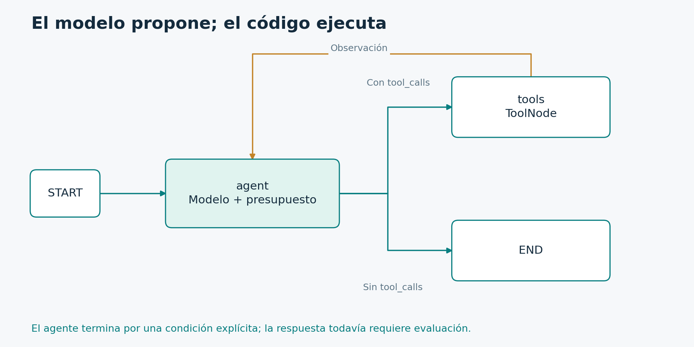

# 3.1. Ciclo del agente y protocolo de herramientas

**Módulo 3: Agente con herramientas · Dedicación estimada: 20 minutos**

## Qué vas a poder hacer

- Reconstruir un ciclo completo a partir de los mensajes.
- Relacionar cada llamada con su resultado mediante tool_call_id.

**Antes de empezar:** Módulo 2; especialmente MessagesState y reducers.

## De una ruta fija a una decisión del modelo

La flecha de retorno representa una observación nueva. El modelo no ejecuta la herramienta: la aplicación procesa tool_calls en el nodo tools.

[Diagrama editable en Mermaid](../_recursos/ciclo_agente.mmd).

Recorramos el diagrama desde la entrada. El nodo agent recibe el historial y llama al modelo. La respuesta puede incluir texto, solicitudes de herramientas o ambas cosas, según el proveedor. Para decidir la transición miramos si existen tool_calls.

Si hay solicitudes, el grafo habilita el nodo tools. Ese nodo ejecuta las herramientas registradas y devuelve observaciones. Después una arista fija vuelve a agent. El modelo recibe ahora el resultado y puede responder o pedir otra acción.

Si no hay tool_calls, la ruta finaliza. Esta condición es mecánica: no verifica por sí misma que la respuesta sea correcta. Por eso la evaluación de evidencia y de calidad se diseña aparte.

Una vuelta puede contener varios mensajes. La solicitud del asistente tiene un identificador de llamada. La herramienta debe responder con ese identificador. El modelo necesita esa correspondencia para interpretar qué resultado responde a qué solicitud.

El ciclo es una forma de feedback. El modelo propone, la herramienta observa el mundo y la siguiente decisión incorpora esa observación. No necesitamos exponer razonamiento interno del modelo para controlar la ejecución. Trabajamos con acciones estructuradas y resultados verificables.

En este laboratorio todas las herramientas serán de lectura. Las acciones con efectos externos irán a un flujo de aprobación separado. También pondremos un límite a las llamadas del modelo y un recursion_limit como protección del runtime.

Antes de programar, sigan dos recorridos: una respuesta directa y una consulta con una herramienta. ¿Cuántas veces se ejecuta agent en el segundo caso? Normalmente dos, una para solicitar la consulta y otra para interpretar el resultado. ¿Puede haber más? Sí, por eso necesitamos una política de presupuesto.

## El protocolo también es un contrato de datos

| Orden | Tipo de mensaje | Contenido relevante |
| --- | --- | --- |
| 1 | HumanMessage | “¿Cómo reviso la conexión VPN?” |
| 2 | AIMessage | tool_calls: lookup(query="vpn"), id="c1" |
| 3 | ToolMessage | Resultado KB-01, tool_call_id="c1" |
| 4 | AIMessage | Respuesta final basada en KB-01 |

Esta tabla muestra el historial de una interacción. Primero llega un HumanMessage con la consulta. Luego el modelo produce un AIMessage con una llamada a lookup. La llamada incluye un nombre, argumentos y un id que aquí representamos como c1.

La aplicación ejecuta la herramienta y construye un ToolMessage. Su tool_call_id debe coincidir con c1. Ese vínculo permite que el proveedor asocie el resultado a la solicitud original. Si el modelo pidió varias herramientas, cada llamada debe recibir su observación correspondiente.

El último AIMessage contiene la respuesta final. El modelo puede mencionar KB-01 porque la herramienta aportó esa evidencia. Si el artículo no existe o no resuelve la consulta, la respuesta debería reconocer la limitación.

Un error frecuente consiste en agregar el resultado como un nuevo mensaje del usuario. Eso pierde la semántica del protocolo. Otro consiste en eliminar la solicitud al recortar el historial y conservar únicamente el ToolMessage. Esa conversación puede ser rechazada por el proveedor.

ToolNode se encarga de varios detalles de ejecución y de construir las observaciones a partir de herramientas registradas. Nosotros seguimos siendo responsables de los contratos, permisos y errores de esas herramientas.

Identificá la relación que debe conservarse incluso al resumir una conversación: la pareja entre solicitud y resultado. Un resumen de texto no sustituye arbitrariamente los mensajes estructurados de una llamada todavía pendiente.

## Distinguir tres finales

Un AIMessage sin tool_calls indica que el modelo dejó de pedir herramientas en ese ciclo. Eso no demuestra que la respuesta sea correcta. Un límite alcanzado produce una salida controlada de la aplicación. Una excepción puede abortar el recorrido y requerir tratamiento o recuperación. No conviene mostrar esas tres situaciones como un único estado de éxito.

Si un modelo solicita varias herramientas, cada llamada tiene su identificador. El código debe conservar las observaciones correspondientes antes de continuar con un historial válido. ToolNode puede ejecutar las herramientas solicitadas, pero sus permisos y efectos siguen siendo responsabilidad de cada implementación.

## Ejercicio de diagnóstico

Tenés una llamada con id c1 y una respuesta con tool_call_id c2. El texto de la respuesta es correcto, pero la relación está rota. Corregir el contenido no arregla la identidad. El resultado debe asociarse a la llamada que realmente produjo esa observación.

Ahora imaginá un recorte de contexto que conserva el AIMessage con c1 y elimina su ToolMessage. El próximo envío puede incumplir el protocolo del proveedor. El recorte debe operar sobre intercambios completos y comprender qué solicitudes todavía están pendientes.

## Comprobación de comprensión

**Antes de mirar la respuesta:** ¿Por qué una respuesta de herramienta se representa con ToolMessage y no como un nuevo mensaje del usuario?

### Respuesta razonada

Porque tiene un origen y una relación estructural con una llamada previa. Convertirla en texto de usuario pierde esa semántica y puede cambiar cómo el modelo interpreta la conversación.

## Documentación para profundizar

- [Quickstart](https://docs.langchain.com/oss/python/langgraph/quickstart)
- [Herramientas](https://docs.langchain.com/oss/python/langchain/tools)

---

[Índice del módulo](00_inicio_del_modulo.md) · [Índice del curso](../README.md) · [Anterior](../02_Graph_API/06_practica_agregar_validacion_sin_romper_el_grafo.md) · [Siguiente](../03_Agente_con_herramientas/02_diseno_de_herramientas_y_conexion_del_modelo.md)
