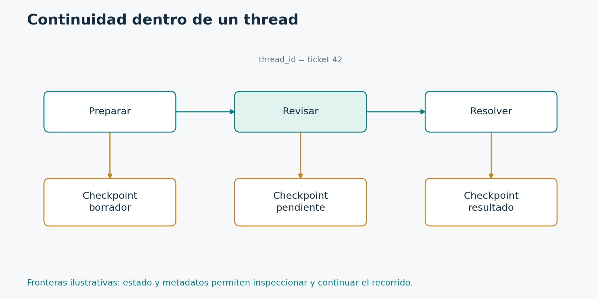

# 4.1. Checkpoint, thread y memoria compartida

**Módulo 4: Persistencia y aprobación · Dedicación estimada: 20 minutos**

## Qué vas a poder hacer

- Elegir dónde debe vivir un dato según su duración y alcance.
- Interpretar la identidad de una ejecución persistente.

**Antes de empezar:** Módulos 1 a 3.

## Persistir no es guardar todo en messages

| Mecanismo | Alcance | Ejemplo |
| --- | --- | --- |
| Estado | Datos del recorrido actual | Borrador y decisión de aprobación |
| Checkpointer | Historia de ejecución de un thread | Continuar el ticket t-101 |
| Store | Datos definidos por la aplicación entre threads | Preferencias de un usuario |
| Context | Dependencias de la invocación | Identidad autenticada y clientes |

Estas cuatro piezas resuelven necesidades diferentes. El estado contiene los datos con los que trabajan los nodos. El checkpointer conserva versiones de la ejecución dentro de un thread. Un Store guarda datos que la aplicación decide compartir entre conversaciones o ejecuciones. El contexto llega desde la invocación.

Un thread es una identidad de continuidad. No tiene que equivaler a un usuario. Un usuario puede tener varios tickets, cada uno con su thread. Dos usuarios pueden colaborar sobre un caso si la aplicación lo permite. La política de acceso pertenece al servicio.

El checkpointer guarda estado y metadatos necesarios para continuar el trabajo. Por eso es útil para pausas, inspección y recuperación. InMemorySaver lo hace en RAM y pierde los datos cuando termina el proceso. SQLite usa un archivo. Un backend de producción como PostgreSQL permite otras capacidades operativas, pero también requiere administrar conexiones, migraciones y retención.

El Store guarda elementos bajo namespaces y claves definidos por la aplicación. Podríamos almacenar la preferencia de idioma de un usuario. Eso no significa que cualquier conversación pueda leerla. El namespace y los filtros deben respetar la identidad autenticada.

No conviene poner todo en messages porque es cómodo. Un borrador aprobado puede requerir un campo y una versión propios. Un secreto no debe quedar persistido como parte del historial. Y una conexión no debe convertirse en un objeto serializado del estado.

Una pregunta útil es cuánto debería vivir cada dato. Si pertenece al recorrido de un ticket, probablemente esté en el estado. Si debe atravesar varios threads, necesita una estrategia de memoria compartida. Si es una dependencia del proceso, corresponde al contexto o al ciclo de vida del servicio.

## Una identidad de continuidad

La figura muestra fronteras de negocio. El runtime también puede registrar checkpoints de entrada y otras fronteras internas; no es un conteo exhaustivo de snapshots.

[Diagrama editable en Mermaid](../_recursos/checkpoints.mmd).

El diagrama muestra un thread con varias versiones de ejecución. Después de ciertos pasos del runtime tenemos checkpoints que contienen valores y metadatos como el trabajo pendiente. La secuencia no es simplemente una lista de textos de conversación.

Al invocar un grafo con checkpointer, proporcionamos un thread_id en configurable. Reutilizarlo continúa esa identidad. Elegir otro comienza una identidad independiente. Si dos solicitudes ajenas comparten accidentalmente el mismo id, podemos mezclar contexto. Por eso la aplicación genera o valida ese identificador y comprueba quién puede utilizarlo.

get_state permite inspeccionar el snapshot actual. values contiene el estado y next indica nodos pendientes. get_state_history permite recorrer checkpoints. Estas herramientas sirven para depurar decisiones y entender dónde quedó una ejecución.

También podemos seleccionar un checkpoint anterior y crear una continuación alternativa. Eso es útil para explorar qué habría pasado con otra decisión, pero no es un botón de deshacer del mundo externo. Una llamada a un servicio ya realizada no se revierte porque cambiemos un snapshot.

En una recuperación debemos distinguir reanudar trabajo pendiente de reproducir una ejecución desde un punto histórico. Los nodos posteriores al checkpoint elegido pueden ejecutarse de nuevo, incluidos modelos o APIs. Por lo tanto, cualquier efecto externo requiere una política de repetición.

El checkpoint ayuda a conocer qué se hizo y qué falta. La corrección del negocio depende además de los contratos de cada paso y de cómo manejamos un proceso que se interrumpe en una frontera incómoda. Ahora veremos una pausa explícita para pedir una decisión humana.

## StateSnapshot y GraphOutput no son lo mismo

GraphOutput v2 contiene el resultado de una invocación y sus interrupciones. get_state(config) devuelve un StateSnapshot asociado a un checkpoint. Su atributo values permite inspeccionar datos; next indica nodos pendientes; tasks puede aportar errores o interrupciones. El primero responde «qué devolvió esta invocación»; el segundo ayuda a responder «qué hay persistido y qué puede continuar».

## Decisión por duración

| Dato | Opción inicial | Motivo |
| --- | --- | --- |
| Borrador de un ticket | Estado con checkpointer | Debe sobrevivir hasta su resolución |
| Preferencia de idioma | Store o base de negocio | Se usa en conversaciones distintas |
| Credencial del proveedor | Configuración protegida del servicio | No debe formar parte del historial |
| Cliente de base de datos | Recurso del proceso | Debe abrirse y cerrarse según el ciclo de vida |
| Orden facturada | Base transaccional de negocio | Tiene integridad propia y efectos externos |

Un checkpoint no reemplaza automáticamente el modelo de datos transaccional. Puede conservar la referencia a una orden sin convertirse en la fuente maestra de facturación. La ejecución y el dominio pueden tener necesidades de retención y consistencia distintas.

## Comprobación de comprensión

**Antes de mirar la respuesta:** ¿Usar el email del usuario como único thread_id es siempre correcto?

### Respuesta razonada

No. Una persona puede tener varias conversaciones o tickets. Elegí una identidad por continuidad de negocio y registrá su relación con los usuarios autorizados. Conocer el ID no debe conceder acceso.

## Documentación para profundizar

- [Persistencia](https://docs.langchain.com/oss/python/langgraph/persistence)
- [Checkpointers](https://docs.langchain.com/oss/python/langgraph/checkpointers)
- [Stores](https://docs.langchain.com/oss/python/langgraph/stores)

---

[Índice del módulo](00_inicio_del_modulo.md) · [Índice del curso](../README.md) · [Anterior](../03_Agente_con_herramientas/06_cuando_usar_create_agent.md) · [Siguiente](../04_Persistencia_y_aprobacion/02_interrupciones_y_aprobacion_humana.md)
