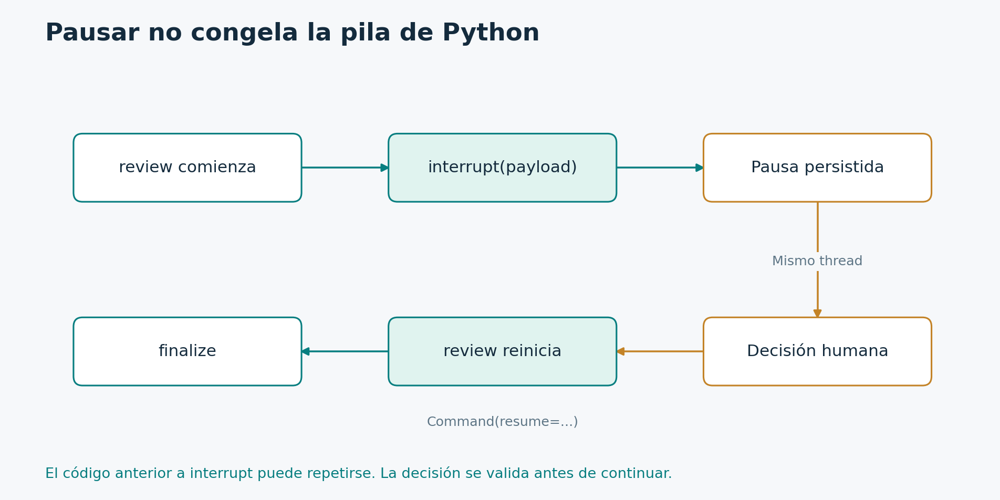

# 4.2. Interrupciones y aprobación humana

**Módulo 4: Persistencia y aprobación · Dedicación estimada: 25 minutos**

## Qué vas a poder hacer

- Pausar un flujo y reanudarlo con una decisión tipada.
- Identificar el código que puede repetirse al reanudar.

**Antes de empezar:** Tópico 4.1 y lectura de GraphOutput v2.

## Qué significa esperar



Command(resume=...) suministra el valor que devuelve interrupt. La reanudación no restaura una pila de Python congelada en una línea arbitraria.

[Diagrama editable en Mermaid](../_recursos/interrupcion.mmd).

interrupt permite suspender un recorrido y presentar un dato a quien debe decidir. El payload puede incluir el identificador del caso y el borrador que estamos proponiendo. Debe ser serializable.

Para que la pausa sea recuperable necesitamos un checkpointer y un thread_id. La ejecución devuelve información de la interrupción en lugar de completar todos los nodos. El servicio puede responder al cliente indicando que hace falta una revisión, sin mantener una conexión abierta durante horas.

Cuando llega la decisión invocamos el mismo grafo, con el mismo thread_id y un Command cuyo campo resume contiene el valor elegido. Ese valor se convierte en el retorno de interrupt dentro del nodo.

El detalle más importante es que el nodo interrumpido vuelve a empezar desde su inicio. El runtime no conserva una pila de Python congelada en cualquier línea. Por eso el código anterior a interrupt puede repetirse. Si allí enviáramos un correo, podríamos enviarlo otra vez.

La solución suele consistir en separar preparación, aprobación y efecto. Antes de interrupt realizamos trabajo puro o seguro de repetir. Después, una decisión validada determina si se habilita la operación. La operación externa necesita idempotencia igualmente, porque puede haber otros fallos.

No atrapamos la señal interna de interrupt con un except genérico que la convierta en éxito o error ordinario. Tampoco cambiamos arbitrariamente el orden de varios interrupt dentro del mismo nodo. Sus valores de reanudación deben corresponder al punto correcto.

En la práctica usaremos un único interrupt y una decisión booleana. Es un contrato intencionalmente pequeño que podremos verificar con dos rutas.

## Contrato del nodo

```python
from typing import TypedDict
from langgraph.types import interrupt, Command

class ReviewState(TypedDict, total=False):
    ticket_id: str
    draft: str
    approved: bool
    status: str

def review(s: ReviewState):
    decision = interrupt({
        "ticket_id": s["ticket_id"], "draft": s["draft"]
    })
    if not isinstance(decision, bool):
        raise ValueError("La decisión debe ser booleana")
    return {"approved": decision}
```

### Lectura del código

Los números corresponden a las líneas del bloque, contando las líneas en blanco.

| Línea | Qué hace y por qué está aquí |
| --- | --- |
| 1 | Importamos el contrato tipado de diccionario. |
| 2 | Importamos la pausa y el comando que utilizaremos al reanudar. |
| 4 | Definimos campos que se completarán durante el recorrido. |
| 5 | ticket_id identifica el caso de negocio. |
| 6 | draft conserva exactamente la propuesta que se revisará. |
| 7 | approved guardará la decisión validada. |
| 8 | status contendrá el resultado del flujo. |
| 10 | El nodo recibe los datos del caso. |
| 11 | Llamamos a interrupt con un payload serializable. |
| 12 | Exponemos el identificador y el borrador que requiere aprobación. |
| 13 | Cerramos payload y llamada. En la primera ejecución se suspende aquí. |
| 14 | Al reanudar, verificamos que la decisión sea realmente un booleano. |
| 15 | Rechazamos tipos inválidos en vez de interpretar cadenas como true por su valor booleano. |
| 16 | Devolvemos la aprobación como actualización del estado. |

Creamos review.py como un laboratorio independiente. El grafo recibirá ticket_id y draft. El nodo review no redacta: solamente presenta la propuesta y espera una decisión.

El contrato de reanudación es booleano. True aprueba y False rechaza. Una cadena que diga false no debe interpretarse como aprobación porque en Python una cadena no vacía es verdadera. Por eso verificamos el tipo explícitamente.

Esta validación de tipo no demuestra quién aprobó. El servicio que llama a resume debe autenticar a la persona y verificar sus permisos. También debe vincular la aprobación con la versión exacta del borrador. Si cambia el contenido después de que alguien lo revisa, la autorización podría dejar de corresponder.

En la primera ejecución no alcanzamos el return. El runtime suspende y conserva lo necesario. En la reanudación el nodo empieza otra vez y interrupt entrega la decisión. Recién entonces validamos y escribimos approved.

Observá que no hay una operación externa antes de la pausa. Esa elección hace seguro repetir el comienzo del nodo. En el siguiente bloque añadiremos una finalización simulada para observar ambas rutas sin enviar mensajes ni modificar sistemas.

## Ensamblado con checkpointer

```python
from langgraph.graph import StateGraph, START, END
from langgraph.checkpoint.memory import InMemorySaver

def finalize(s: ReviewState):
    status = "SIMULADO" if s["approved"] else "RECHAZADO"
    return {"status": status}

review_builder = StateGraph(ReviewState)
review_builder.add_node("review", review)
review_builder.add_node("finalize", finalize)
review_builder.add_edge(START, "review")
review_builder.add_edge("review", "finalize")
review_builder.add_edge("finalize", END)
approval = review_builder.compile(checkpointer=InMemorySaver())
```

### Lectura del código

Los números corresponden a las líneas del bloque, contando las líneas en blanco.

| Línea | Qué hace y por qué está aquí |
| --- | --- |
| 1 | Importamos el constructor y los marcadores de control. |
| 2 | InMemorySaver guarda checkpoints dentro del proceso. |
| 4 | finalize representa la resolución posterior a la decisión. |
| 5 | Elegimos un estado de simulación o rechazo según approved. |
| 6 | Devolvemos únicamente status. |
| 8 | Creamos el constructor de revisión. |
| 9 | Registramos el nodo que puede interrumpirse. |
| 10 | Registramos la finalización simulada. |
| 11 | Comenzamos por review. |
| 12 | Cuando review complete, se habilita finalize. |
| 13 | La finalización termina el flujo. |
| 14 | Compilamos incorporando un saver en memoria. |

Este ensamblado tiene una secuencia corta, pero puede durar mucho tiempo de calendario debido a la espera humana. El checkpointer hace posible separar esa espera de una conexión o de una función bloqueada.

finalize solamente escribe un estado. SIMULADO indica que se alcanzó la ruta aprobada. No afirma que se haya enviado nada. RECHAZADO indica que la propuesta no fue aprobada.

InMemorySaver conserva datos mientras viva este proceso. Si cerramos Python, los perdemos. Es adecuado para aprender la semántica y para ciertas pruebas, pero no para una aprobación que deba sobrevivir al reinicio del servicio.

El saver pertenece al ciclo de vida de la aplicación. Si construyéramos uno nuevo para cada solicitud, no encontraríamos los checkpoints anteriores. En producción administramos su conexión durante el arranque y el cierre del servicio.

Podríamos usar aristas condicionales y dos nodos separados para aprobar y rechazar. Aquí una función pequeña alcanza porque sólo cambia un campo. Cuando la ruta aprobada incorpore una operación real, convendrá separar la política del efecto y probar que un rechazo nunca lo habilite.

El resultado demuestra una idea importante: no necesitamos muchos nodos para tener control. Necesitamos que cada transición importante sea explícita y que la persistencia corresponda a la duración real del proceso.

## Primera llamada y reanudación

```python
cfg = {"configurable": {"thread_id": "t-101"}}
pending = approval.invoke(
    {"ticket_id": "INC-101", "draft": "Revisar la VPN."},
    cfg, version="v2",
)
print(pending.interrupts[0].value)
done = approval.invoke(
    Command(resume=True), cfg, version="v2"
)
print(done.value["status"])
```

### Lectura del código

Los números corresponden a las líneas del bloque, contando las líneas en blanco.

| Línea | Qué hace y por qué está aquí |
| --- | --- |
| 1 | configurable contiene la identidad del thread que conservaremos al reanudar. |
| 2 | Iniciamos la ejecución con un borrador. |
| 3 | Proporcionamos el caso y el texto que se revisará. |
| 4 | Pasamos la configuración y seleccionamos GraphOutput v2. |
| 5 | La llamada termina con una interrupción pendiente. |
| 6 | Leemos el payload del primer interrupt. En este laboratorio sabemos que habrá exactamente uno. |
| 7 | Reanudamos el mismo grafo. |
| 8 | Command transporta True y cfg mantiene el mismo thread_id. |
| 9 | La ejecución completa review y luego finalize. |
| 10 | Imprimimos SIMULADO, que representa el resultado aprobado. |

La primera invocación devuelve una interrupción. En v2 consultamos interrupts y luego value del objeto Interrupt para recuperar el payload. Esta value corresponde al payload del interrupt y no debe confundirse con value de GraphOutput, que contiene el estado de salida.

La segunda invocación recibe Command con resume igual a True. Conservamos exactamente cfg. Si cambiáramos thread_id, buscaríamos otra continuidad y no estaríamos reanudando la misma pausa.

Para rechazar utilizamos False en una ejecución nueva con otro thread_id. No reutilicen ciegamente un thread terminado para intentar reanudar una interrupción que ya fue consumida. La aplicación debe consultar su estado y tratar las respuestas duplicadas.

En el laboratorio aprobamos inmediatamente por comodidad. En un servicio real, la decisión podría llegar minutos u horas después. La API devolvería un identificador de revisión pendiente y otra operación recibiría la aprobación autenticada.

Si hay varias interrupciones simultáneas, podemos necesitar mapear identificadores de interrupt a sus respuestas. Nuestro ejemplo tiene una para mantener claro el mecanismo. Tampoco mostramos approved como un campo que el usuario pueda escribir directamente en una entrada cualquiera: la transición autorizada debe estar controlada por el servicio.

Ahora ejecuten y observen que finalize no aparece antes de la reanudación. Esa es la propiedad central de la pausa.

[Archivo ejecutable: review_memory.py](../_laboratorio/review_memory.py) · [Archivo ejecutable: review_graph.py](../_laboratorio/review_graph.py)

En la versión del laboratorio, review_graph.py contiene las definiciones sin iniciar casos al importarse. review_memory.py crea un saver y ejecuta la demostración. Esta separación permite reconstruir el grafo en un proceso nuevo sin volver a crear la solicitud original.

## Lectura crítica de la aprobación

El payload muestra ticket_id y draft, y la decisión debe ser realmente booleana. El string «false» no equivale a False: en Python es una cadena no vacía y podría evaluarse como verdadera si se tratara sin validación. El nodo rechaza tipos incorrectos.

La validación booleana demuestra la forma del dato, no quién decidió. Una API debe autenticar al revisor y vincular la aprobación con una versión o hash del borrador. Si el contenido cambió, no se debe reutilizar una aprobación anterior como si correspondiera al nuevo texto.

## Comprobación de comprensión

**Antes de mirar la respuesta:** ¿Es seguro enviar un correo inmediatamente antes de interrupt?

### Respuesta razonada

Puede enviarse de nuevo al reanudar porque el nodo vuelve a comenzar. Separá la preparación de la acción y protegé el adaptador de efectos con idempotencia. La pausa por sí sola no evita repeticiones.

## Documentación para profundizar

- [Interrupciones](https://docs.langchain.com/oss/python/langgraph/interrupts)
- [Checkpointers](https://docs.langchain.com/oss/python/langgraph/checkpointers)

---

[Índice del módulo](00_inicio_del_modulo.md) · [Índice del curso](../README.md) · [Anterior](../04_Persistencia_y_aprobacion/01_checkpoint_thread_y_memoria_compartida.md) · [Siguiente](../04_Persistencia_y_aprobacion/03_persistencia_con_sqlite_entre_procesos.md)
