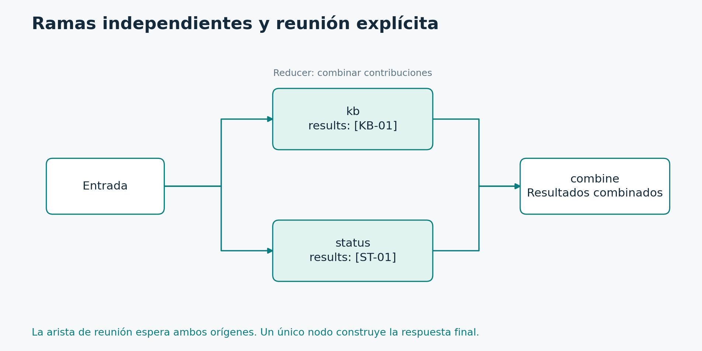

# 5.1. Paralelismo estático y barreras de reunión

**Módulo 5: Orquestación avanzada · Dedicación estimada: 20 minutos**

## Qué vas a poder hacer

- Expresar ramas independientes y una reunión explícita.
- Combinar contribuciones sin depender del orden de finalización.

**Antes de empezar:** Reducers, superpasos y Graph API.

## Paralelizar trabajo conocido



La lista de orígenes de la arista de reunión exige completar kb y status antes de ejecutar combine en este diseño.

[Diagrama editable en Mermaid](../_recursos/paralelismo.mmd).

En un fan-out fijo conocemos las ramas al construir el grafo. Por ejemplo, una consulta a la base de conocimiento y otra al estado del servicio. Si son independientes, pueden ejecutarse en el mismo superpaso.

El fan-in reúne resultados. Para una dependencia conjunta podemos expresar una arista desde una lista de nodos hacia el nodo de reunión. Esa forma indica que necesitamos que finalicen ambos. Con ramas de distinta profundidad hay que diseñar cuidadosamente la barrera o utilizar mecanismos de diferimiento apropiados, en lugar de asumir que cualquier conexión individual espera a todas.

Si las ramas escriben campos distintos, sus actualizaciones pueden coexistir. Si ambas escriben results, necesitamos un reducer. Cada rama devuelve sólo su contribución y el reducer las combina.

Paralelizar puede reducir latencia cuando domina la espera de operaciones independientes. También aumenta concurrencia, presión sobre servicios, consumo simultáneo y complejidad de errores. El tiempo total ya no se interpreta simplemente como la suma de todos los tiempos individuales.

No asumimos un orden de finalización. Guardamos identificadores de fuente y ordenamos al presentar si hace falta. Una lista concatenada no es por sí sola una política de prioridad.

Si una rama falla después de que otra completó trabajo, la recuperación depende de checkpoints y de la semántica del runtime. Los efectos externos de cada rama necesitan las mismas precauciones de idempotencia que estudiamos antes.

El siguiente ejemplo usa Send porque la cantidad de fuentes viene en la entrada. Ese mecanismo crea tareas con estados particulares para cada trabajo, manteniendo un contrato de agregación explícito.

## Programa completo

```python
from operator import add
from typing import Annotated, TypedDict
from langgraph.graph import StateGraph, START, END

class State(TypedDict, total=False):
    question: str
    results: Annotated[list[str], add]
    answer: str

def kb(s: State):
    return {"results": ["KB-01: revisar red"]}

def status(s: State):
    return {"results": ["ST-01: servicio operativo"]}

def combine(s: State):
    return {"answer": " / ".join(sorted(s["results"]))}

builder = StateGraph(State)
builder.add_node("kb", kb)
builder.add_node("status", status)
builder.add_node("combine", combine)
builder.add_edge(START, "kb")
builder.add_edge(START, "status")
builder.add_edge(["kb", "status"], "combine")
builder.add_edge("combine", END)
graph = builder.compile()

if __name__ == "__main__":
    print(graph.invoke({"question": "VPN", "results": []}, version="v2").value)
```

[Archivo ejecutable: parallel.py](../_laboratorio/parallel.py)

## Lectura por responsabilidades

State define la consulta, las contribuciones y la respuesta. Annotated asocia operator.add al campo results. Cada rama devuelve una lista de un elemento. combine construye una representación ordenada y escribe answer una sola vez.

Las dos aristas desde START habilitan trabajo independiente. add_edge(["kb", "status"], "combine") expresa una barrera con ambos orígenes. No equivale conceptualmente a dos rutas condicionales exclusivas: aquí se esperan dos resultados. El último enlace termina el recorrido.

## Costos del paralelismo

Si las consultas tardan 2 y 3 segundos y la reunión 1, una ejecución secuencial ideal suma 6 segundos; una paralela ideal se acerca a 4, más costos de coordinación. Es un cálculo ilustrativo. Límites del proveedor, conexiones, CPU o bloqueos pueden reducir la mejora real.

El paralelismo no elimina el costo total de las operaciones y puede aumentar la carga instantánea. max_concurrency acota trabajo concurrente en una invocación; no reemplaza una política global de cuotas compartida entre todas las solicitudes del servicio.

## Fallos parciales

Definí si la reunión requiere todas las fuentes o admite resultados parciales. En el primer caso, una fuente fallida impide completar la respuesta. En el segundo, el estado debe representar por fuente su resultado o error, y la respuesta debe comunicar la cobertura real. No conviertas todo error en una lista vacía: perderías la diferencia entre «no existe evidencia» y «no pude consultar».

## Actividad

Agregá una tercera fuente determinística con un identificador propio y actualizá la barrera. Comprobá que answer incluya las tres contribuciones. Si agregás el nodo pero no la dependencia de reunión adecuada, el dibujo del flujo y su contrato pueden dejar de coincidir.

## Comprobación de comprensión

**Antes de mirar la respuesta:** ¿Por qué se ordenan los resultados al construir answer?

### Respuesta razonada

Para que la presentación dependa de un criterio explícito y no de una interpretación del orden de finalización. La concatenación conserva contribuciones, pero no define por sí sola el orden de negocio.

## Documentación para profundizar

- [Implementación con Graph API](https://docs.langchain.com/oss/python/langgraph/use-graph-api)
- [Graph API](https://docs.langchain.com/oss/python/langgraph/graph-api)

---

[Índice del módulo](00_inicio_del_modulo.md) · [Índice del curso](../README.md) · [Anterior](../04_Persistencia_y_aprobacion/06_practica_reinicio_rechazo_y_aislamiento.md) · [Siguiente](../05_Orquestacion_avanzada/02_distribucion_dinamica_con_send.md)
