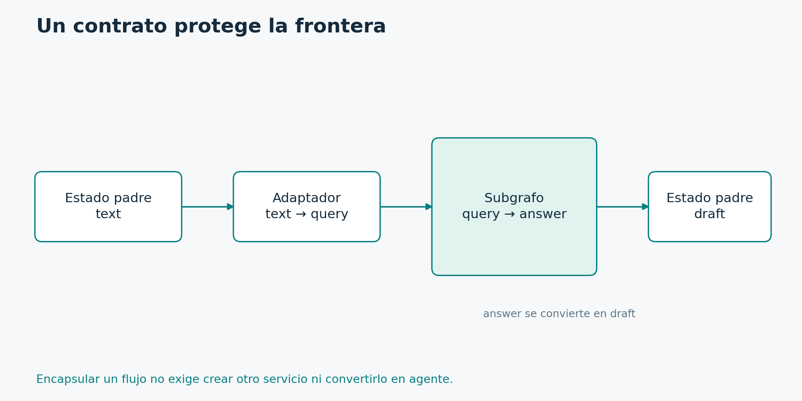

# 5.4. Subgrafos y fronteras de estado

**Módulo 5: Orquestación avanzada · Dedicación estimada: 25 minutos**

## Qué vas a poder hacer

- Encapsular una responsabilidad reutilizable.
- Traducir contratos entre padre e hijo y elegir el alcance de su memoria.

**Antes de empezar:** Módulos 2 y 4; tópico 5.3.

## Encapsular sin crear otro servicio



El adaptador recibe text y entrega query al hijo; luego convierte answer en draft. Esta frontera limita el acoplamiento entre contratos.

[Diagrama editable en Mermaid](../_recursos/subgrafo.mmd).

Un subgrafo encapsula un flujo que podemos utilizar como parte de otro. Puede servir para reutilizar una política de recuperación, un proceso de investigación o una responsabilidad especializada.

Hay dos situaciones frecuentes. Si padre e hijo comparten claves compatibles, podemos agregar el grafo compilado como nodo. Si sus contratos son diferentes, escribimos una función adaptadora que convierte la entrada, invoca el subgrafo y traduce la salida.

En el diagrama, el padre maneja un ticket y el hijo una consulta. La frontera transforma ticket.text en query y transforma answer en draft. Esa conversión evita que todo el estado de la aplicación se filtre al subgrafo por comodidad.

La memoria también necesita una decisión. El comportamiento por invocación sirve para una subtarea independiente. La persistencia por thread puede ser apropiada cuando una responsabilidad mantiene conversación entre llamadas. El checkpointer del padre puede propagarse a subgrafos, pero debemos revisar las opciones concretas de memoria y los namespaces.

Si invocamos concurrentemente una misma responsabilidad con memoria compartida, podemos introducir conflictos de identidad. Para trabajadores independientes preferimos aislar el estado por tarea. Compartir memoria debe ser una necesidad, no una consecuencia accidental de reutilizar un objeto.

Un subgrafo no es automáticamente un agente. Puede contener funciones determinísticas. Tampoco exige un servicio separado. Podemos encapsular código sin agregar una nueva unidad de despliegue.

La pregunta antes de crear uno es qué contrato queremos proteger y reutilizar. Si no podemos identificar esa frontera, quizá una función o un nodo sean suficientes.

## Programa con esquemas distintos

```python
from typing import TypedDict
from langgraph.graph import StateGraph, START, END

class ChildState(TypedDict, total=False):
    query: str
    answer: str

class ParentState(TypedDict, total=False):
    text: str
    draft: str

def search(s: ChildState):
    return {"answer": "KB-01" if "vpn" in s["query"].lower() else "SIN_EVIDENCIA"}

child_builder = StateGraph(ChildState)
child_builder.add_node("search", search)
child_builder.add_edge(START, "search")
child_builder.add_edge("search", END)
child = child_builder.compile()

def adapt(s: ParentState):
    result = child.invoke({"query": s["text"]}, version="v2")
    return {"draft": result.value["answer"]}

parent_builder = StateGraph(ParentState)
parent_builder.add_node("research", adapt)
parent_builder.add_edge(START, "research")
parent_builder.add_edge("research", END)
parent = parent_builder.compile()

if __name__ == "__main__":
    print(parent.invoke({"text": "VPN"}, version="v2").value)
```

[Archivo ejecutable: subgraph.py](../_laboratorio/subgraph.py)

## Lectura del adaptador

ChildState describe query y answer; ParentState describe text y draft. search es una consulta determinística para mantener visible la frontera. El constructor del hijo registra search y sus extremos. child es el grafo compilado.

adapt convierte text en query, invoca child y toma answer de result.value para producir draft. El padre registra adapt como research. El resultado conserva text y agrega draft. Ningún paso necesita copiar todo el estado del padre al hijo.

Si ambos comparten claves compatibles, es posible registrar directamente el grafo compilado como nodo. El adaptador es necesario cuando queremos traducir contratos o controlar explícitamente qué cruza la frontera.

## Memoria del subgrafo

| Opción al compilar el hijo | Uso | Consecuencia |
| --- | --- | --- |
| checkpointer=None, predeterminada | Subtareas independientes | Memoria por invocación; puede heredar saver del padre |
| checkpointer=True | Continuidad del hijo en el thread | Acumula estado entre llamadas; requiere controlar conflictos |
| checkpointer=False | Llamada sin checkpoint del hijo | No ofrece pausa o recuperación durable del subgrafo |

Las capacidades persistentes del hijo requieren que el padre tenga un checkpointer. La demostración del archivo no lo configura porque solo enseña traducción de esquemas. No invoques concurrentemente la misma memoria por thread como si cada llamada tuviera identidad independiente: pueden producirse conflictos de namespace. Esta distinción está detallada en la documentación de subgrafos.

## Práctica

Cambiá el contrato del hijo para devolver también source_count y elegí si el padre necesita conservarlo. Si no lo necesita, el adaptador puede omitirlo. Encapsular no consiste en exportar automáticamente todos los campos internos.

## Comprobación de comprensión

**Antes de mirar la respuesta:** ¿Un subgrafo requiere su propio contenedor o microservicio?

### Respuesta razonada

No. Es una composición de flujos dentro del runtime. Separar despliegues es otra decisión, con costos de red, operación y contratos distribuidos que deben justificarse.

## Documentación para profundizar

- [Subgrafos](https://docs.langchain.com/oss/python/langgraph/use-subgraphs)

---

[Índice del módulo](00_inicio_del_modulo.md) · [Índice del curso](../README.md) · [Anterior](../05_Orquestacion_avanzada/03_command_actualizacion_y_navegacion.md) · [Siguiente](../05_Orquestacion_avanzada/05_functional_api_y_recuperacion_de_tareas.md)
