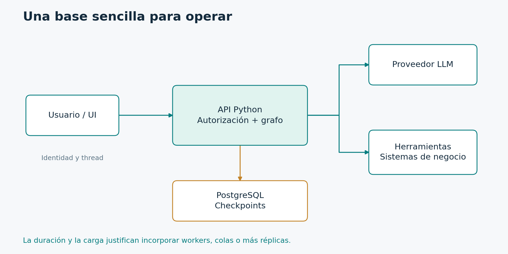

# 6.4. Seguridad y arquitectura de despliegue

**Módulo 6: Operación y proyecto final · Dedicación estimada: 25 minutos**

## Qué vas a poder hacer

- Ubicar controles de confianza en el servicio y los adaptadores.
- Diseñar una base operable con un grafo y persistencia externa.

**Antes de empezar:** Módulos 3 y 4; nociones de una API de servicio.

## Fronteras de confianza

| Entrada o recurso | Riesgo | Control de la aplicación |
| --- | --- | --- |
| Texto del usuario | Instrucciones fuera del alcance | Validación y límites de herramientas |
| Documento recuperado | Prompt injection | Tratar contenido como datos y aplicar permisos |
| thread_id | Acceso a otra conversación | Autorizar propiedad y alcance |
| Reanudación humana | Aprobación inválida o tardía | Identidad y versión exacta de propuesta |
| Logs y checkpoints | Exposición o retención excesiva | Minimización, acceso y política de borrado |

Las entradas pueden contener instrucciones que contradicen el propósito del sistema. Eso puede venir del usuario o de un documento recuperado. El modelo debe tratar esas fuentes según su papel, pero la protección principal de las operaciones está en la aplicación.

La herramienta expone una capacidad acotada. Validamos argumentos, restringimos recursos y usamos credenciales con el alcance necesario. No damos una función genérica de ejecución cuando el caso sólo requiere consultar un catálogo.

thread_id merece atención particular. Conocer un identificador no debería otorgar acceso a una conversación. La API debe vincularlo con una identidad y un ámbito autorizado. Esa comprobación ocurre antes de inspeccionar, continuar o modificar el thread.

La aprobación humana necesita autenticidad y correspondencia. Registramos quién aprobó y qué versión revisó. Si cambia el borrador, la decisión anterior puede dejar de ser válida. Si la misma aprobación llega dos veces, no generamos dos acciones.

También controlamos los datos guardados. Un checkpoint conserva información suficiente para continuar y puede contener mensajes sensibles. Definimos retención, respaldo y permisos. Los logs deberían mostrar lo necesario para depurar sin copiar indiscriminadamente todo el contenido.

Estos controles no requieren una arquitectura enorme. Pueden comenzar en una API sencilla y adaptadores pequeños. Lo importante es que su ubicación sea explícita y que existan pruebas de aislamiento y rechazo.

## Arquitectura inicial

La API concentra autenticación y autorización. El backend permite conservar continuidad entre procesos. Los nodos no requieren microservicios individuales.

[Diagrama editable en Mermaid](../_recursos/despliegue.mmd).

Una base sencilla puede tener una API Python con el grafo y PostgreSQL como backend persistente. El servicio utiliza adaptadores para el proveedor del modelo y para las herramientas de negocio. No necesitamos separar cada nodo en un microservicio.

La API autentica, valida entradas y controla el acceso al thread. Durante el arranque construye el grafo y administra conexiones. Las respuestas distinguen resultado final, revisión pendiente y error. Streaming puede exponerse mediante un canal adecuado, por ejemplo eventos hacia el cliente.

El proceso de aplicación puede quedar sin estado local necesario para continuar porque el backend conserva la ejecución. Aun así, debemos controlar invocaciones concurrentes sobre el mismo thread. La estrategia depende del despliegue: serializar por thread o utilizar capacidades del servidor de agentes cuando corresponda.

Si una tarea dura demasiado para el ciclo de una solicitud o necesitamos aislar su carga, incorporamos un worker y un mecanismo de cola. No los introducimos simplemente porque usamos agentes. El criterio es duración, concurrencia y recuperación operativa.

Podemos empaquetar la aplicación con Docker y comenzar con Docker Compose junto a PostgreSQL. Un despliegue administrado mediante Agent Server es otra opción con sus propias capacidades. No es obligatorio para ejecutar la librería localmente.

Antes de aumentar infraestructura necesitamos pruebas de reinicio, observabilidad, permisos y manejo de versiones. Kubernetes no corrige un flujo que duplica acciones o mezcla identidades.

La arquitectura se considera completa cuando sabemos cómo entra una consulta, dónde se conserva, quién puede reanudarla y cómo se observa su resultado. Ese recorrido será la base del proyecto final.

## Contrato público del servicio

| Operación | Validación previa | Resultado |
| --- | --- | --- |
| Crear caso | Entrada, identidad y alcance | ID y resultado o revisión pendiente |
| Consultar estado | Permiso sobre el caso | Proyección pública de su estado |
| Reanudar | Revisor autorizado, decisión y versión | Continuación o rechazo de la petición |
| Consumir eventos | Acceso al thread | Eventos filtrados para la UI |

No expongas get_state o resume directamente como una capacidad pública sin controles. El servicio traduce su API al runtime y define qué datos se pueden devolver. Un campo privado del esquema no es una redacción automática de logs o streams.

## Concurrencia sobre el mismo caso

Dos solicitudes que reanudan el mismo thread pueden competir. La solución debe ser coherente con la cantidad de réplicas: un lock local solo coordina un proceso. Podés serializar trabajo por thread o usar mecanismos del backend/servidor elegidos. La aprobación duplicada debe reconocerse como la misma intención y no generar una segunda acción.

## Pasar de SQLite a PostgreSQL

La migración requiere instalar y fijar la integración correspondiente, crear las estructuras del saver según su procedimiento, configurar conexiones y mantenerlas abiertas durante las invocaciones. No consiste solo en cambiar el texto de la URL en SqliteSaver. El adapter, su configuración y su ciclo de vida son distintos.

La guía oficial del checkpointer documenta PostgresSaver y variantes asíncronas. Usá su setup como parte controlada de la inicialización o migración del servicio; no crees tablas en cada solicitud. Definí respaldo, restauración y retención de checkpoints según las necesidades de los casos.

## Orden de implementación recomendado

1. Fijar contratos de entrada, salida, estado y autorización.
2. Ejecutar pruebas de rutas y recuperación con el mismo diseño de backend que se usará.
3. Exponer una API pequeña y construir el grafo durante el arranque del servicio.
4. Administrar pools y clientes en el ciclo de vida de la aplicación.
5. Incorporar logs, métricas y un conjunto estable de evaluación.
6. Empaquetar y medir carga antes de agregar workers, colas o más réplicas.

## Actividad

Identificá dónde se aplica el permiso de tenant en una futura herramienta SQL. La respuesta debe nombrar el adaptador y su consulta parametrizada con filtro de alcance, además de la autenticación de entrada. «En el prompt del sistema» no describe un control suficiente sobre la base.

## Comprobación de comprensión

**Antes de mirar la respuesta:** ¿Agregar Kubernetes corrige un flujo que duplica una acción?

### Respuesta razonada

No. El despliegue administra procesos e infraestructura. La identidad de intención, idempotencia y aprobación corresponden al diseño del flujo y sus integraciones.

## Documentación para profundizar

- [Checkpointers](https://docs.langchain.com/oss/python/langgraph/checkpointers)
- [Herramientas](https://docs.langchain.com/oss/python/langchain/tools)
- [Servidor local](https://docs.langchain.com/oss/python/langgraph/local-server)

---

[Índice del módulo](00_inicio_del_modulo.md) · [Índice del curso](../README.md) · [Anterior](../06_Operacion_y_proyecto_final/03_pruebas_observabilidad_y_evaluacion.md) · [Siguiente](../06_Operacion_y_proyecto_final/05_proyecto_final_soporte_con_evidencia_y_aprobacion.md)
