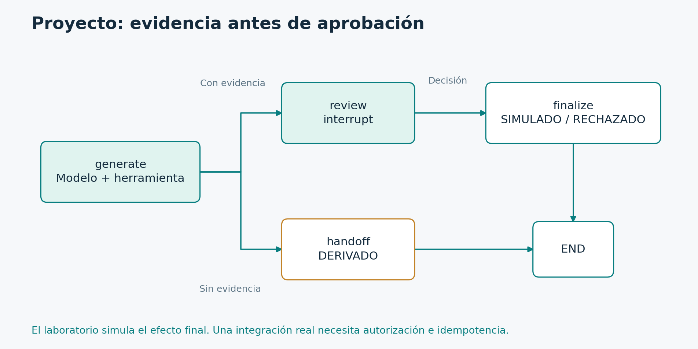

# 6.5. Proyecto final: soporte con evidencia y aprobación

**Módulo 6: Operación y proyecto final · Dedicación estimada: 60 minutos**

## Qué vas a poder hacer

- Integrar generación, evaluación de evidencia y revisión humana.
- Demostrar recuperación y salidas alternativas con un proyecto ejecutable.

**Antes de empezar:** Los seis módulos hasta el tópico 6.4.

## Resultado a construir

Un caso recibe ticket_id y question. El asistente consulta la herramienta y produce un borrador. Si no hay evidencia utilizable, deriva. Si hay una propuesta respaldada por la fuente didáctica, solicita aprobación. Aprobar conduce a SIMULADO; rechazar conduce a RECHAZADO. El caso debe poder reanudarse desde otro proceso.



La evidencia controla la elegibilidad para revisión. La aprobación humana controla la ruta final. La acción externa permanece simulada en el laboratorio.

[Diagrama editable en Mermaid](../_recursos/proyecto.mmd).

## Consigna

Antes de mirar la implementación, diseñá el estado y las aristas. Indicá qué campos necesita generate, qué datos muestra review y cómo finaliza handoff. Después implementá o completá el ejemplo y compará tu recorrido con la referencia.

## Implementación de referencia

```python
from langchain_core.messages import HumanMessage, ToolMessage
from langgraph.graph import StateGraph, START, END
from langgraph.checkpoint.memory import InMemorySaver
from langgraph.types import Command
from support import build_support
from review_graph import ReviewState, review, finalize

class CaseState(ReviewState):
    question: str
    evidence_ids: list[str]
    calls: int

def build_case(checkpointer, model_with_tools=None):
    assistant = build_support(model_with_tools)

    def generate(s: CaseState):
        result = assistant.invoke(
            {"messages": [HumanMessage(content=s["question"])], "calls": 0},
            {"recursion_limit": 12}, version="v2",
        )
        messages = result.value["messages"]
        draft = str(messages[-1].content)
        # Contrato didáctico de una KB de una sola entrada; no es un validador semántico.
        evidence = any(isinstance(m, ToolMessage) and "KB-01:" in str(m.content) for m in messages)
        usable = evidence and not draft.startswith("Límite:")
        return {"draft": draft, "calls": result.value["calls"],
                "evidence_ids": ["KB-01"] if usable else []}

    def route(s: CaseState):
        return "review" if s["evidence_ids"] else "handoff"

    def handoff(s: CaseState):
        return {"status": "DERIVADO", "approved": False}

    builder = StateGraph(CaseState)
    builder.add_node("generate", generate)
    builder.add_node("review", review)
    builder.add_node("finalize", finalize)
    builder.add_node("handoff", handoff)
    builder.add_edge(START, "generate")
    builder.add_conditional_edges("generate", route, {"review": "review", "handoff": "handoff"})
    builder.add_edge("review", "finalize")
    builder.add_edge("finalize", END)
    builder.add_edge("handoff", END)
    return builder.compile(checkpointer=checkpointer)

if __name__ == "__main__":
    graph = build_case(InMemorySaver())
    cfg = {"configurable": {"thread_id": "case-1"}}
    pending = graph.invoke({"ticket_id": "T1", "question": "Ayuda con VPN"}, cfg, version="v2")
    print("Pendiente:", pending.interrupts[0].value)
    done = graph.invoke(Command(resume=True), cfg, version="v2")
    print("Final:", done.value["status"])
```

[Archivo ejecutable: project.py](../_laboratorio/project.py)

## Lectura guiada

**Importaciones.** HumanMessage representa la pregunta que recibe el agente. ToolMessage permite distinguir evidencia observada de texto producido por el modelo. StateGraph y los marcadores construyen el flujo. InMemorySaver sirve para la demostración local. Command reanuda la revisión. build_support reutiliza el ciclo ya probado; ReviewState, review y finalize conservan el contrato del módulo 4.

**CaseState.** Hereda ticket_id, draft, approved y status; agrega question, evidence_ids y calls. El nuevo estado compone responsabilidades existentes sin duplicar las definiciones del nodo de revisión.

**build_case.** Recibe explícitamente el checkpointer y, opcionalmente, una dependencia de modelo. Construye assistant una vez para ese grafo. Esta fábrica permite usar InMemorySaver en pruebas y SQLite en la CLI.

**generate.** Convierte la pregunta en HumanMessage e inicia calls en cero para esa generación. Aplica recursion_limit a la invocación del asistente y obtiene el historial final mediante result.value. Extrae el borrador del último mensaje. Inspecciona observaciones reales ToolMessage para reconocer KB-01 y descarta la salida de límite como candidata. Devuelve únicamente los campos que produjo.

**Límite de la validación de evidencia.** Buscar KB-01 en una observación es suficiente para la base de una sola entrada del ejercicio. No valida semánticamente un texto arbitrario. Para una aplicación real, la herramienta debería devolver referencias estructuradas con metadatos; después se verifican pertenencia y fidelidad de las afirmaciones. El prototipo no afirma haber resuelto ese problema completo.

**route y handoff.** route selecciona revisión si evidence_ids tiene contenido. La otra ruta escribe DERIVADO y approved False. La ausencia de evidencia no se convierte en una aprobación implícita.

**Constructor.** Registra generate, review, finalize y handoff. La arista inicial conduce a generación. La ruta condicional expresa alternativas exclusivas. Las otras tres aristas llevan revisión a finalización y ambas salidas a END. compile añade el checkpointer recibido.

**Demostración en memoria.** El bloque principal crea una identidad, inicia el caso, imprime el payload pendiente y entrega True. La aprobación está codificada solo para demostrar el mecanismo; una interfaz real debe obtenerla de una persona autorizada.

## Persistencia entre procesos

project_disk.py envuelve la misma fábrica con SqliteSaver. Su interfaz permite iniciar y reanudar sin modificar el código:

```powershell
& $cursoPython project_disk.py start --thread final-1 --question "Ayuda con VPN"
& $cursoPython project_disk.py resume --thread final-1 --decision aprobar
& $cursoPython project_disk.py start --thread final-2 --question "Impresora"
```

[Archivo ejecutable: project_disk.py](../_laboratorio/project_disk.py)

La primera ejecución muestra PENDIENTE y termina. La segunda imprime SIMULADO. La tercera deriva directamente y no debe abrir una revisión sobre evidencia inexistente. Usá un thread nuevo para cada caso independiente.

## Casos obligatorios

| Caso | Propiedad esperada |
| --- | --- |
| VPN y aprobación | Se consulta KB-01, pausa y finaliza SIMULADO |
| VPN y rechazo | Finaliza RECHAZADO |
| Impresora | DERIVADO sin revisión de una fuente inexistente |
| Presupuesto agotado | No se invoca otra vez al modelo |
| Reinicio con pausa | Reanuda desde el mismo archivo y thread |
| Otro thread | No hereda la decisión del caso anterior |

## Entregables

Entregá el código, una descripción del contrato de estado, un diagrama de rutas, instrucciones de ejecución y evidencia de los casos. Añadí un apartado de límites: fuente didáctica, simulación de acciones, autenticación pendiente y evaluación del proveedor.

El siguiente incremento debe responder al caso real. Puede ser un adaptador PostgreSQL para la evidencia, una API autenticada o una evaluación de calidad. No es necesario introducir todos los patrones del curso dentro del mismo proyecto para demostrar competencia.

## Comprobación de comprensión

**Antes de mirar la respuesta:** ¿Por qué el proyecto no obliga a usar Send y varios agentes?

### Respuesta razonada

Porque su caso básico no requiere esas capacidades. La competencia incluye reconocer cuándo no agregan valor. Podés extender la consulta a fuentes independientes y justificar Send si cambia el requisito.

## Documentación para profundizar

- [Graph API](https://docs.langchain.com/oss/python/langgraph/graph-api)
- [Interrupciones](https://docs.langchain.com/oss/python/langgraph/interrupts)
- [Checkpointers](https://docs.langchain.com/oss/python/langgraph/checkpointers)
- [Pruebas](https://docs.langchain.com/oss/python/langgraph/test)

---

[Índice del módulo](00_inicio_del_modulo.md) · [Índice del curso](../README.md) · [Anterior](../06_Operacion_y_proyecto_final/04_seguridad_y_arquitectura_de_despliegue.md) · [Siguiente](../06_Operacion_y_proyecto_final/06_evaluacion_final_y_guia_de_decisiones.md)
