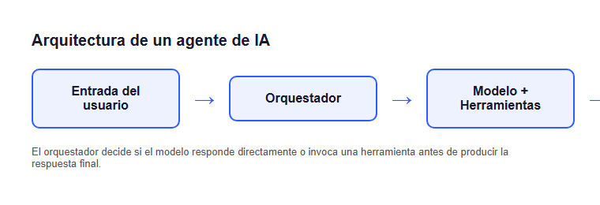

# Arquitectura de un agente de IA

Un agente de IA combina tres capas: percibe información del entorno,
razona sobre esa información y actúa en consecuencia. Este tópico
combina texto, código, una imagen y una tabla — el fixture principal de
punta a punta para Rich Markdown Rendering.

## El orquestador

El componente central de un agente es el **orquestador**: decide si el
modelo puede responder directamente o si primero necesita invocar una
herramienta externa (por ejemplo, una búsqueda o una consulta a una
base de datos) antes de producir la respuesta final.

```python
def orquestar(mensaje: str) -> str:
    if requiere_herramienta(mensaje):
        resultado = invocar_herramienta(mensaje)
        return generar_respuesta(mensaje, contexto=resultado)
    return generar_respuesta(mensaje)
```

## Diagrama de referencia



*Figura: el orquestador decide si el modelo responde directamente o
invoca una herramienta antes de producir la respuesta final.*

## Componentes y su responsabilidad

| Componente | Responsabilidad | Entrada | Salida |
| --- | --- | --- | --- |
| Orquestador | Decidir el siguiente paso | Mensaje del usuario | Plan de acción |
| Modelo | Generar texto/decisiones | Prompt + contexto | Texto generado |
| Herramientas | Ejecutar acciones externas | Parámetros | Resultado de la acción |

## Conclusión

La arquitectura de un agente separa claramente la decisión (orquestador)
de la ejecución (modelo y herramientas) — esa separación es lo que
permite agregar nuevas herramientas sin rediseñar el flujo completo.
