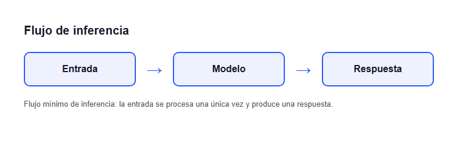

# Flujo de inferencia

El flujo más simple de un sistema de IA tiene tres pasos: una entrada,
el modelo que la procesa, y la respuesta que produce.

*Figura: flujo mínimo de inferencia — la entrada se procesa una única
vez y produce una respuesta.*

Este es el caso base sobre el que se construyen flujos más complejos
(como el del agente con orquestador visto en el tópico anterior), que
agregan pasos intermedios de decisión antes de llegar a la respuesta
final.
