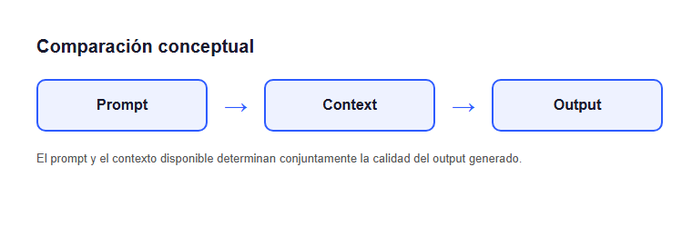

# Comparación conceptual — Prompt, Context, Output

La calidad de una respuesta generada por un modelo depende de dos
entradas distintas: el **prompt** (la instrucción explícita) y el
**context** (la información disponible además del prompt, como
historial de conversación o documentos relevantes).

*Figura: el prompt y el contexto disponible determinan conjuntamente la
calidad del output generado.*

## Diferencias

| Elemento | Qué es | Quién lo define |
| --- | --- | --- |
| Prompt | La instrucción explícita enviada al modelo | El usuario o la aplicación |
| Context | Información adicional disponible (historial, documentos) | La aplicación |
| Output | El texto generado por el modelo | El modelo |

Un mismo prompt puede producir outputs muy distintos según qué contexto
lo acompañe — por eso ambos elementos se diseñan juntos, nunca por
separado.
