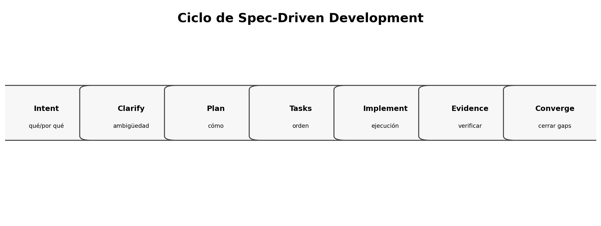

# Qué es Spec-Driven Design / Development

> **Nivel:** intermedio-avanzado. Este tópico forma parte de un recorrido progresivo.

## Competencias de aprendizaje

- Distinguir SDD de documentación tradicional y de prompting ad-hoc.
- Explicar por qué la especificación pasa a ser un artefacto operativo.
- Reconocer los componentes mínimos de un flujo SDD.
- Relacionar intención, evidencia e implementación.

## Conceptos esenciales

- **Intención:** qué problema se quiere resolver, para quién y con qué resultado observable
- **Especificación:** descripción estructurada del comportamiento esperado y sus límites
- **Diseño:** decisiones técnicas que realizan la especificación sin reemplazarla
- **Evidencia:** pruebas, métricas y verificaciones que demuestran conformidad
- **Convergencia:** ciclo de corrección hasta alinear código, pruebas y especificación

## Desarrollo técnico

### Del prompt a la especificación

Un prompt puede producir código rápido, pero suele mezclar necesidad, diseño y detalles accidentales. SDD separa deliberadamente estas capas: primero se estabiliza el **qué** y el **por qué**; después se decide el **cómo**.

### Especificación como activo operativo

Una buena spec es versionable, revisable y verificable. Captura alcance, escenarios, criterios de aceptación, restricciones, riesgos y preguntas abiertas. Su valor es reducir grados de libertad donde una interpretación equivocada sería costosa.

### SDD moderno y agentes

En 2026, herramientas como GitHub Spec Kit y Kiro formalizan flujos de requisitos→diseño→tareas→implementación. El principio común es mantener la intención explícita, revisar artefactos intermedios y exigir evidencia antes de aceptar el resultado.

## Ejemplo aplicado

Supongamos el pedido: **"agregá login"**.

| Enfoque | Resultado probable |
|---|---|
| Prompt directo | El agente elige proveedor, persistencia y UX por su cuenta. |
| SDD | Primero se define quién inicia sesión, qué estados existen, qué riesgos hay y cómo se verifica. |
| SDD + agente | El agente implementa dentro de límites explícitos y la revisión compara código vs. spec. |

## Práctica guiada

Tomá una petición ambigua real —por ejemplo, “exportar reportes a Excel”— y escribí un prompt de una línea y una mini-spec con objetivo, usuarios, alcance, 3 escenarios, restricciones y criterios de aceptación.

## Errores frecuentes y cómo evitarlos

- Confundir SDD con waterfall.
- Escribir una spec tan detallada que codifique la implementación antes de decidir el diseño.
- Aceptar código porque compila sin verificar intención.

## Checklist de dominio

- [ ] Puedo explicar el concepto sin consultar el material.
- [ ] Puedo reconocer cuándo aplicarlo y cuándo no.
- [ ] Puedo transformar una necesidad ambigua en un artefacto verificable.
- [ ] Puedo identificar riesgos, supuestos y criterios de aceptación.
- [ ] Puedo revisar el resultado de un agente sin delegar el juicio técnico.

## Preguntas de reflexión

1. ¿Qué riesgo reduce este artefacto o práctica?
2. ¿Qué evidencia pedirías antes de pasar a la siguiente fase?
3. ¿Qué cambiaría en un sistema regulado o multi-equipo?

## Fuentes y lecturas recomendadas

- [GitHub Spec Kit — What is Spec-Driven Development?](https://github.com/github/spec-kit/blob/main/docs/concepts/sdd.md)
- [Microsoft — Spec-Driven Development: A Spec-First Approach to AI-Native Engineering](https://developer.microsoft.com/blog/spec-driven-development-ai-native-engineering/)
- [GitHub Spec Kit — documentación oficial](https://github.github.com/spec-kit/)

> **Idea clave:** en SDD, una especificación útil no es documentación ceremonial; es un contrato de intención suficientemente preciso para guiar decisiones y suficientemente verificable para detectar desvíos.
