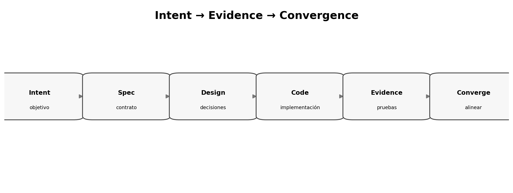

# El ciclo Intent → Evidence → Convergence

> **Nivel:** intermedio-avanzado. Este tópico forma parte de un recorrido progresivo.

## Competencias de aprendizaje

- Construir un ciclo SDD independiente de herramientas.
- Relacionar cada artefacto con una pregunta de ingeniería.
- Definir criterios de entrada y salida por fase.
- Aplicar convergencia sin burocracia.

## Conceptos esenciales

- **Intent:** resultado y límites
- **Clarify:** reducción sistemática de ambigüedad
- **Plan:** decisiones técnicas y contratos
- **Tasks:** unidades implementables
- **Validate:** comparación contra criterios
- **Converge:** cierre de gaps

## Desarrollo técnico

### Cada fase responde una pregunta

Intent responde **qué y por qué**; Clarify elimina interpretaciones peligrosas; Plan decide **cómo**; Tasks divide el trabajo; Implement ejecuta; Validate produce evidencia; Converge corrige diferencias.

### Definition of Ready por fase

Una fase avanza cuando existe información suficiente, no cuando el documento parece completo.

### Convergencia como disciplina

Converger significa iterar hasta que los gaps entre especificación, pruebas y código estén dentro de los umbrales acordados.

## Ejemplo aplicado

| Fase | Pregunta dominante | Evidencia de salida |
|---|---|---|
| Intent | ¿Qué resultado queremos? | objetivos y alcance |
| Clarify | ¿Qué está ambiguo? | decisiones resueltas |
| Plan | ¿Cómo lo construiremos? | diseño y contratos |
| Tasks | ¿Qué se ejecuta primero? | backlog ordenado |
| Validate | ¿Cumple? | tests, revisión, métricas |
| Converge | ¿Qué gap queda? | gaps cerrados o aceptados |

## Práctica guiada

Diseñá un gate simple para cada fase de una feature de recuperación de contraseña. Cada gate debe tener máximo 3 preguntas binarias.

## Errores frecuentes y cómo evitarlos

- Pasar a diseño con aceptación ambigua.
- Tratar Converge como una etapa única final.
- Usar tareas como sustituto de una spec.

## Checklist de dominio

- [ ] Puedo explicar el concepto sin consultar el material.
- [ ] Puedo reconocer cuándo aplicarlo y cuándo no.
- [ ] Puedo transformar una necesidad ambigua en un artefacto verificable.
- [ ] Puedo identificar riesgos, supuestos y criterios de aceptación.
- [ ] Puedo revisar el resultado de un agente sin delegar el juicio técnico.

## Preguntas de reflexión

1. ¿Qué riesgo reduce este artefacto o práctica?
2. ¿Qué evidencia pedirías antes de pasar a la siguiente fase?
3. ¿Qué cambiaría en un sistema regulado o multi-equipo?

## Fuentes y lecturas recomendadas

- [GitHub Spec Kit — Agentic SDD reference](https://github.com/github/spec-kit/blob/main/docs/reference/agentic-sdd.md)
- [GitHub Spec Kit — documentación oficial](https://github.github.com/spec-kit/)
- [Microsoft — Spec-Driven Development: A Spec-First Approach to AI-Native Engineering](https://developer.microsoft.com/blog/spec-driven-development-ai-native-engineering/)

> **Idea clave:** en SDD, una especificación útil no es documentación ceremonial; es un contrato de intención suficientemente preciso para guiar decisiones y suficientemente verificable para detectar desvíos.
