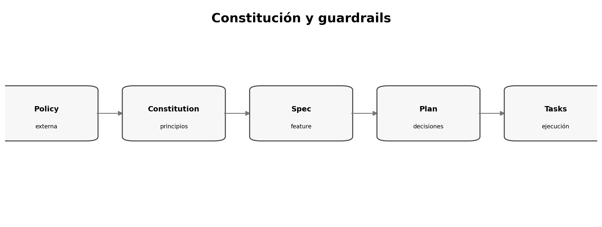

# Constitution: principios y guardrails no negociables

> **Nivel:** intermedio-avanzado. Este tópico forma parte de un recorrido progresivo.

## Competencias de aprendizaje

- Distinguir constitución de requisitos de feature.
- Redactar principios accionables.
- Evitar constituciones extensas.
- Usar guardrails para reducir decisiones repetidas.

## Conceptos esenciales

- **Constitution:** principios persistentes
- **Guardrail:** límite explícito
- **Policy:** regla organizacional
- **Default:** decisión recomendada
- **Exception:** desvío revisado



## Desarrollo técnico

### Qué pertenece aquí

Testing mínimo, seguridad, compatibilidad, observabilidad, versionado y principios estables.

### Pocas reglas, mucho efecto

Reglas vagas como 'usar buenas prácticas' consumen contexto sin aportar criterio.

### Enforcement

Cada principio importante debería mapearse a una revisión, test, pipeline o checklist.

## Ejemplo aplicado

```markdown
## Principio: compatibilidad hacia atrás
- Toda API pública debe preservar consumidores existentes.
- Breaking change requiere versión mayor y plan de migración.
- Evidencia: contract tests + changelog.
```

## Práctica guiada

Escribí una mini-constitución de máximo 10 principios. Cada uno debe incluir regla, razón y evidencia.

## Errores frecuentes y cómo evitarlos

- Copiar un style guide completo.
- Usar absolutos sin excepción.
- Convertir gustos personales en políticas.

## Checklist de dominio

- [ ] Puedo explicar el concepto sin consultar el material.
- [ ] Puedo reconocer cuándo aplicarlo y cuándo no.
- [ ] Puedo transformar una necesidad ambigua en un artefacto verificable.
- [ ] Puedo identificar riesgos, supuestos y criterios de aceptación.
- [ ] Puedo revisar el resultado de un agente sin delegar el juicio técnico.

## Preguntas de reflexión

1. ¿Qué riesgo reduce este artefacto o práctica?
2. ¿Qué evidencia pedirías antes de pasar a la siguiente fase?
3. ¿Qué cambiaría en un sistema regulado o multi-equipo?

## Fuentes y lecturas recomendadas

- [Microsoft — Diving Into Spec-Driven Development With GitHub Spec Kit](https://developer.microsoft.com/blog/spec-driven-development-spec-kit/)
- [GitHub Spec Kit — Quickstart](https://github.com/github/spec-kit/blob/main/docs/quickstart.md)

> **Idea clave:** en SDD, una especificación útil no es documentación ceremonial; es un contrato de intención suficientemente preciso para guiar decisiones y suficientemente verificable para detectar desvíos.
