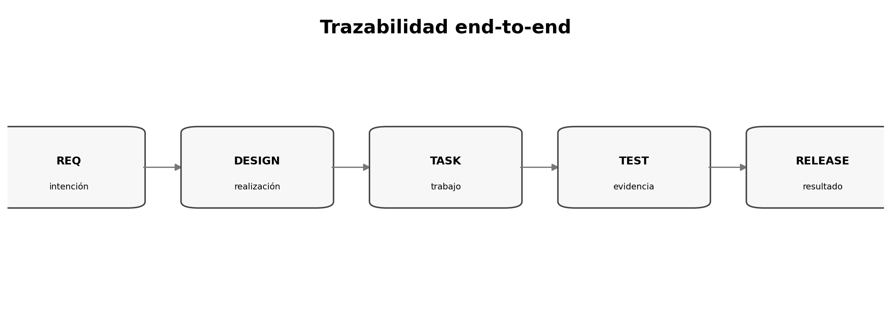

# Tasks y matriz de trazabilidad

> **Nivel:** intermedio-avanzado. Este tópico forma parte de un recorrido progresivo.

## Competencias de aprendizaje

- Descomponer por outcomes.
- Ordenar dependencias.
- Definir evidencia por tarea.
- Construir trazabilidad bidireccional.

## Conceptos esenciales

- **Task:** unidad con outcome/evidencia
- **Dependency:** prerrequisito
- **Vertical slice:** incremento observable
- **Traceability:** enlace entre intención y evidencia
- **Drift:** desalineación entre artefactos

## Desarrollo técnico

### Tamaño adecuado

'Implementar backend' es demasiado grande; una operación con contract tests es accionable.

### Orden por dependencias

Contratos y modelos compartidos suelen preceder consumidores.

### Cobertura bidireccional

Revisar requisito→evidencia y código→intención detecta huérfanos y scope creep.

## Ejemplo aplicado

| Req | Diseño | Tarea | Evidencia |
|---|---|---|---|
| FR-01 | API create | T2 | test_create_report |
| SEC-02 | auth | T5 | test_forbidden |
| NFR-03 | async worker | T7 | load_test_p95 |

## Práctica guiada

Descomponé una feature en 10–15 tareas y construí una matriz de trazabilidad. Buscá al menos un gap.

## Errores frecuentes y cómo evitarlos

- Tareas basadas solo en archivos.
- Dependencias implícitas.
- Mantener IDs inestables.

## Checklist de dominio

- [ ] Puedo explicar el concepto sin consultar el material.
- [ ] Puedo reconocer cuándo aplicarlo y cuándo no.
- [ ] Puedo transformar una necesidad ambigua en un artefacto verificable.
- [ ] Puedo identificar riesgos, supuestos y criterios de aceptación.
- [ ] Puedo revisar el resultado de un agente sin delegar el juicio técnico.

## Preguntas de reflexión

1. ¿Qué riesgo reduce este artefacto o práctica?
2. ¿Qué evidencia pedirías antes de pasar a la siguiente fase?
3. ¿Qué cambiaría en un sistema regulado o multi-equipo?

## Fuentes y lecturas recomendadas

- [GitHub Spec Kit — Quickstart](https://github.com/github/spec-kit/blob/main/docs/quickstart.md)
- [GitHub Spec Kit — Agentic SDD reference](https://github.com/github/spec-kit/blob/main/docs/reference/agentic-sdd.md)

> **Idea clave:** en SDD, una especificación útil no es documentación ceremonial; es un contrato de intención suficientemente preciso para guiar decisiones y suficientemente verificable para detectar desvíos.
