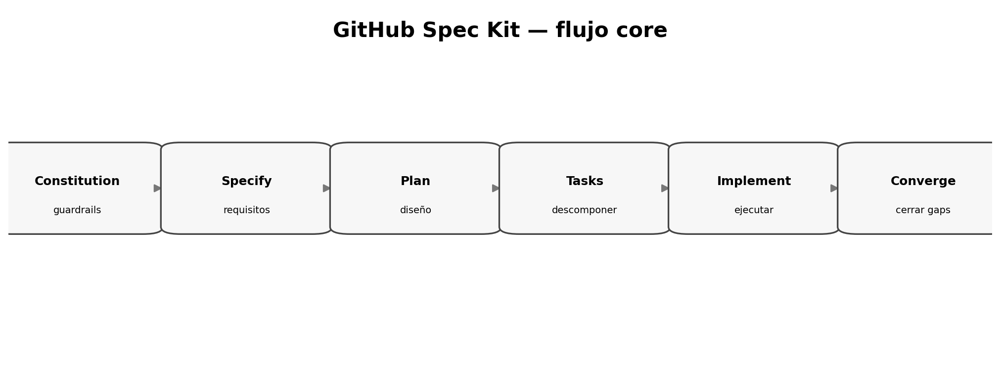

# Spec Kit 2026: arquitectura y filosofía

> **Nivel:** intermedio-avanzado. Este tópico forma parte de un recorrido progresivo.

## Competencias de aprendizaje

- Explicar qué resuelve Spec Kit y qué no.
- Reconocer artefactos/directorios principales.
- Distinguir CLI de comandos agentic.
- Entender el flujo core actual.

## Conceptos esenciales

- **Specify CLI:** bootstrap e instalación
- **Integration:** assets/comandos por agente
- **Templates:** spec/plan/tasks
- **Extensions:** capacidades adicionales
- **Workflows:** secuencias automatizadas



## Desarrollo técnico

### Toolkit, no modelo

Spec Kit coordina prompts, templates, scripts e integraciones; la calidad sigue dependiendo de requisitos y revisión.

### Flujo core actual

La documentación 2026 presenta Constitution una vez por proyecto y luego Specify→Plan→Tasks→Implement→Converge, con Clarify/Checklist/Analyze como gates opcionales.

### Ecosistema

El proyecto evolucionó hacia extensiones, presets, workflows e integraciones múltiples; dominar el core antes de personalizar reduce deuda de proceso.

## Ejemplo aplicado

```text
constitution
    ↓
specify → clarify → plan → checklist → tasks → analyze
                                   ↓
                               implement
                                   ↓
                                converge
                                   ↺
```

## Práctica guiada

Mapeá cada comando a la pregunta que responde, artefacto que produce y gate humano que debería revisarlo.

## Errores frecuentes y cómo evitarlos

- Tratar slash commands como shell.
- Creer que tooling reemplaza requirements engineering.
- Personalizar templates demasiado pronto.

## Checklist de dominio

- [ ] Puedo explicar el concepto sin consultar el material.
- [ ] Puedo reconocer cuándo aplicarlo y cuándo no.
- [ ] Puedo transformar una necesidad ambigua en un artefacto verificable.
- [ ] Puedo identificar riesgos, supuestos y criterios de aceptación.
- [ ] Puedo revisar el resultado de un agente sin delegar el juicio técnico.

## Preguntas de reflexión

1. ¿Qué riesgo reduce este artefacto o práctica?
2. ¿Qué evidencia pedirías antes de pasar a la siguiente fase?
3. ¿Qué cambiaría en un sistema regulado o multi-equipo?

## Fuentes y lecturas recomendadas

- [GitHub Spec Kit — documentación oficial](https://github.github.com/spec-kit/)
- [GitHub Spec Kit — Agentic SDD reference](https://github.com/github/spec-kit/blob/main/docs/reference/agentic-sdd.md)
- [GitHub Spec Kit — Quickstart](https://github.com/github/spec-kit/blob/main/docs/quickstart.md)

> **Idea clave:** en SDD, una especificación útil no es documentación ceremonial; es un contrato de intención suficientemente preciso para guiar decisiones y suficientemente verificable para detectar desvíos.
