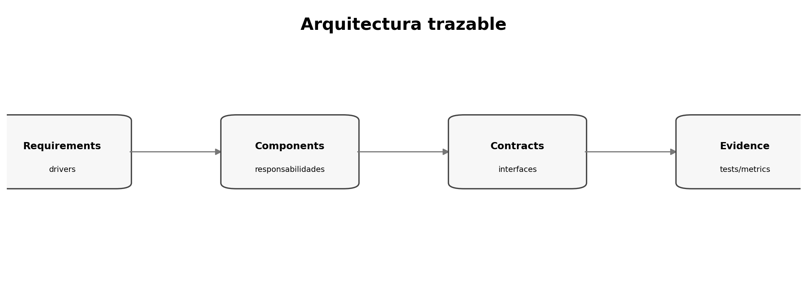

# Arquitectura trazable a requisitos

> **Nivel:** intermedio-avanzado. Este tópico forma parte de un recorrido progresivo.

## Competencias de aprendizaje

- Derivar componentes desde necesidades.
- Evitar arquitectura ornamental.
- Mapear quality attributes a decisiones.
- Crear diagramas útiles y verificables.

## Conceptos esenciales

- **Component:** unidad con responsabilidad coherente
- **Boundary:** frontera de ownership/contrato
- **Quality driver:** requisito que condiciona arquitectura
- **Deployment view:** ejecución de componentes
- **Dependency:** relación que crea acoplamiento

## Desarrollo técnico

### Architecture by drivers

Cada componente importante debe justificar qué requisito, constraint o quality attribute satisface.

### Diagramas con propósito

Cada diagrama debe responder una pregunta: dependencias, flujo, deployment, trust boundaries u ownership.

### Evitar premature distribution

Microservicios, colas o caches requieren evidencia de necesidad, no familiaridad.

## Ejemplo aplicado

| Driver | Decisión | Evidencia |
|---|---|---|
| jobs de 10 min | worker asíncrono | timeout evitado |
| retry cliente | idempotency key | test duplicados |
| PII | cifrado + RBAC | security tests |
| 2 equipos | contrato estable | contract tests |

## Práctica guiada

Diseñá una arquitectura para procesamiento asíncrono y marcá qué requisito justifica cada frontera.

## Errores frecuentes y cómo evitarlos

- Crear componentes sin driver.
- Mezclar vistas lógicas y deployment.
- Usar arquitectura como inventario de herramientas.

## Checklist de dominio

- [ ] Puedo explicar el concepto sin consultar el material.
- [ ] Puedo reconocer cuándo aplicarlo y cuándo no.
- [ ] Puedo transformar una necesidad ambigua en un artefacto verificable.
- [ ] Puedo identificar riesgos, supuestos y criterios de aceptación.
- [ ] Puedo revisar el resultado de un agente sin delegar el juicio técnico.

## Preguntas de reflexión

1. ¿Qué riesgo reduce este artefacto o práctica?
2. ¿Qué evidencia pedirías antes de pasar a la siguiente fase?
3. ¿Qué cambiaría en un sistema regulado o multi-equipo?

## Fuentes y lecturas recomendadas

- [Microsoft — Spec-Driven Development: A Spec-First Approach to AI-Native Engineering](https://developer.microsoft.com/blog/spec-driven-development-ai-native-engineering/)
- [Kiro Docs — Specs](https://kiro.dev/docs/specs/)

> **Idea clave:** en SDD, una especificación útil no es documentación ceremonial; es un contrato de intención suficientemente preciso para guiar decisiones y suficientemente verificable para detectar desvíos.
