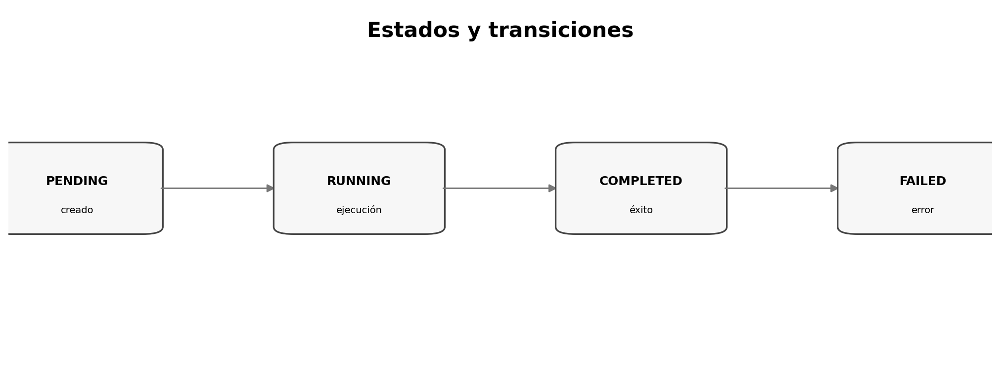

# Flujos, secuencias y máquinas de estado

> **Nivel:** intermedio-avanzado. Este tópico forma parte de un recorrido progresivo.

## Competencias de aprendizaje

- Elegir sequence/state models.
- Definir transiciones permitidas.
- Especificar retries/timeouts.
- Detectar estados terminales.

## Conceptos esenciales

- **State machine:** estados/transiciones válidas
- **Transition guard:** condición de transición
- **Terminal state:** sin transición normal posterior
- **Timeout:** evento temporal
- **Compensation:** neutralización de efectos



## Desarrollo técnico

### Temporalidad explícita

Muchos bugs aparecen cuando se describen estados pero no transiciones.

### Retries

Definir repetibilidad, deduplicación y comportamiento después de timeout.

### Compensación

En sistemas distribuidos, rollback puede ser compensación y no transacción inversa.

## Ejemplo aplicado

```text
PENDING ──start──► RUNNING ──success──► COMPLETED
   │                  │
   └─cancel──► CANCELED
                      └─timeout──► FAILED
```

## Práctica guiada

Modelá estados de un job asíncrono y escribí criterios para rechazar transiciones inválidas.

## Errores frecuentes y cómo evitarlos

- Asumir transiciones libres.
- No definir retry.
- Usar estados para esconder errores.

## Checklist de dominio

- [ ] Puedo explicar el concepto sin consultar el material.
- [ ] Puedo reconocer cuándo aplicarlo y cuándo no.
- [ ] Puedo transformar una necesidad ambigua en un artefacto verificable.
- [ ] Puedo identificar riesgos, supuestos y criterios de aceptación.
- [ ] Puedo revisar el resultado de un agente sin delegar el juicio técnico.

## Preguntas de reflexión

1. ¿Qué riesgo reduce este artefacto o práctica?
2. ¿Qué evidencia pedirías antes de pasar a la siguiente fase?
3. ¿Qué cambiaría en un sistema regulado o multi-equipo?

## Fuentes y lecturas recomendadas

- [Kiro Docs — Specs](https://kiro.dev/docs/specs/)

> **Idea clave:** en SDD, una especificación útil no es documentación ceremonial; es un contrato de intención suficientemente preciso para guiar decisiones y suficientemente verificable para detectar desvíos.
