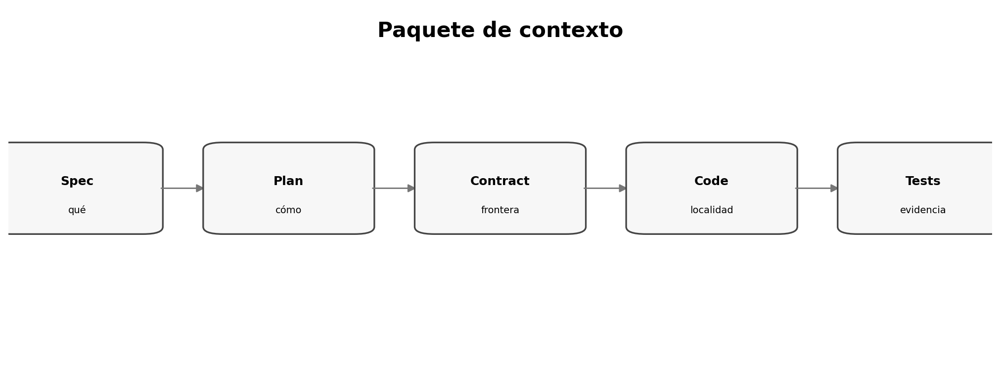

# Context engineering para implementar una spec

> **Nivel:** intermedio-avanzado. Este tópico forma parte de un recorrido progresivo.

## Competencias de aprendizaje

- Diseñar paquetes de contexto.
- Priorizar fuentes por autoridad.
- Reducir ruido.
- Mantener contexto vigente.

## Conceptos esenciales

- **Context package:** artefactos necesarios para una tarea
- **Authority order:** precedencia entre fuentes
- **Locality:** contexto cercano
- **Freshness:** vigencia
- **Context debt:** información vieja/contradictoria



## Desarrollo técnico

### Contexto ≠ corpus completo

Cargar todo aumenta ruido; conviene spec, plan, contratos, archivos locales y comandos.

### Precedencia explícita

Si plan y código divergen, el agente necesita saber qué debe cambiar.

### Refresh checkpoints

Después de un cambio grande, actualizar el paquete evita decisiones obsoletas.

## Ejemplo aplicado

```text
Tarea T7
├─ spec.md: FR-4, NFR-2
├─ plan.md: API
├─ contracts/openapi.yaml
├─ src/api/report.py
├─ tests/test_report_api.py
└─ command: pytest tests/test_report_api.py
```

## Práctica guiada

Construí un context package para una tarea real y justificá cada archivo incluido/excluido.

## Errores frecuentes y cómo evitarlos

- Incluir todo 'por las dudas'.
- No declarar autoridad.
- Usar specs viejas sin marcar.

## Checklist de dominio

- [ ] Puedo explicar el concepto sin consultar el material.
- [ ] Puedo reconocer cuándo aplicarlo y cuándo no.
- [ ] Puedo transformar una necesidad ambigua en un artefacto verificable.
- [ ] Puedo identificar riesgos, supuestos y criterios de aceptación.
- [ ] Puedo revisar el resultado de un agente sin delegar el juicio técnico.

## Preguntas de reflexión

1. ¿Qué riesgo reduce este artefacto o práctica?
2. ¿Qué evidencia pedirías antes de pasar a la siguiente fase?
3. ¿Qué cambiaría en un sistema regulado o multi-equipo?

## Fuentes y lecturas recomendadas

- [Anthropic — Claude Code best practices](https://www.anthropic.com/engineering/claude-code-best-practices)
- [GitHub Spec Kit — Agentic SDD reference](https://github.com/github/spec-kit/blob/main/docs/reference/agentic-sdd.md)

> **Idea clave:** en SDD, una especificación útil no es documentación ceremonial; es un contrato de intención suficientemente preciso para guiar decisiones y suficientemente verificable para detectar desvíos.
