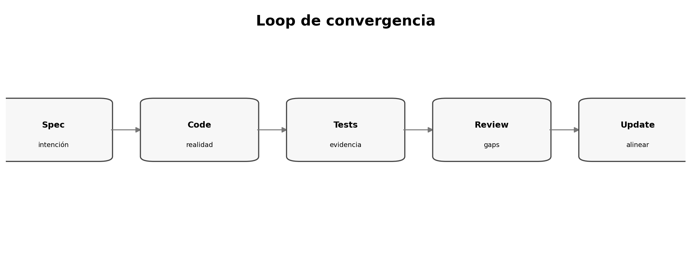

# Spec drift, code drift y convergencia

> **Nivel:** intermedio-avanzado. Este tópico forma parte de un recorrido progresivo.

## Competencias de aprendizaje

- Reconocer tipos de drift.
- Definir autoridad.
- Diseñar checks.
- Cerrar loops.

## Conceptos esenciales

- **Spec drift:** spec desactualizada
- **Code drift:** código viola spec
- **Test drift:** tests obsoletos
- **Convergence check:** comparación explícita
- **Baseline:** estado aceptado



## Desarrollo técnico

### Drift es inevitable

La madurez está en detectarlo y reconciliarlo.

### Detectores

Contract tests, schemas, IDs y review ayudan; semántica aún requiere juicio.

### Decidir qué cambia

No siempre gana la spec; si intención cambió, se actualiza y propaga.

## Ejemplo aplicado

```text
SPEC ─────────────┐
                  ▼
PLAN ─────► CODE ─────► TESTS
 ▲                 │       │
 └──── converge ◄──┴───────┘
```

## Práctica guiada

Inventá un caso donde spec y código divergen pero el código representa mejor la intención actual; describí la reconciliación.

## Errores frecuentes y cómo evitarlos

- Spec inmutable por dogma.
- Actualizar tests sin revisar requisitos.
- Ignorar drift operativo.

## Checklist de dominio

- [ ] Puedo explicar el concepto sin consultar el material.
- [ ] Puedo reconocer cuándo aplicarlo y cuándo no.
- [ ] Puedo transformar una necesidad ambigua en un artefacto verificable.
- [ ] Puedo identificar riesgos, supuestos y criterios de aceptación.
- [ ] Puedo revisar el resultado de un agente sin delegar el juicio técnico.

## Preguntas de reflexión

1. ¿Qué riesgo reduce este artefacto o práctica?
2. ¿Qué evidencia pedirías antes de pasar a la siguiente fase?
3. ¿Qué cambiaría en un sistema regulado o multi-equipo?

## Fuentes y lecturas recomendadas

- [GitHub Spec Kit — documentación oficial](https://github.github.com/spec-kit/)
- [GitHub Spec Kit — What is Spec-Driven Development?](https://github.com/github/spec-kit/blob/main/docs/concepts/sdd.md)

> **Idea clave:** en SDD, una especificación útil no es documentación ceremonial; es un contrato de intención suficientemente preciso para guiar decisiones y suficientemente verificable para detectar desvíos.
