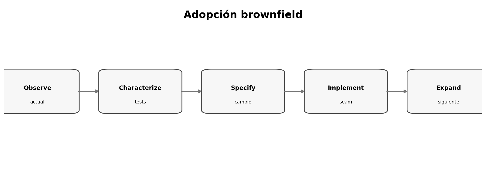

# Adoptar SDD en un repositorio existente

> **Nivel:** intermedio-avanzado. Este tópico forma parte de un recorrido progresivo.

## Competencias de aprendizaje

- Elegir una frontera inicial.
- Reconstruir contexto mínimo.
- Evitar documentación retrospectiva masiva.
- Crear una primera feature trazable.

## Conceptos esenciales

- **Brownfield:** sistema con historia/restricciones
- **Characterization:** descripción verificable del comportamiento actual
- **Seam:** frontera intervenible
- **Incremental adoption:** adopción por cambios
- **Legacy constraint:** comportamiento a preservar



## Desarrollo técnico

### No especificar todo el pasado

El costo sería enorme y la precisión dudosa; empezar por la próxima feature o bug importante.

### Characterization primero

Capturar comportamiento actual relevante con tests, ejemplos y contratos.

### Expandir desde seams

Cada cambio deja mejores artefactos y aumenta la porción gobernada por specs.

## Ejemplo aplicado

```text
Legacy system
┌─────────────────────────────┐
│       área no tocada         │
│       ┌────────────┐         │
│       │ seam nuevo │◄─ spec  │
│       └────────────┘         │
└─────────────────────────────┘
```

## Práctica guiada

Elegí un repo existente y definí un seam de adopción. Listá qué comportamiento actual hay que caracterizar.

## Errores frecuentes y cómo evitarlos

- Documentar todo antes de empezar.
- Suponer que el código refleja intención correcta.
- Romper compatibilidad para limpiar.

## Checklist de dominio

- [ ] Puedo explicar el concepto sin consultar el material.
- [ ] Puedo reconocer cuándo aplicarlo y cuándo no.
- [ ] Puedo transformar una necesidad ambigua en un artefacto verificable.
- [ ] Puedo identificar riesgos, supuestos y criterios de aceptación.
- [ ] Puedo revisar el resultado de un agente sin delegar el juicio técnico.

## Preguntas de reflexión

1. ¿Qué riesgo reduce este artefacto o práctica?
2. ¿Qué evidencia pedirías antes de pasar a la siguiente fase?
3. ¿Qué cambiaría en un sistema regulado o multi-equipo?

## Fuentes y lecturas recomendadas

- [GitHub Spec Kit — documentación oficial](https://github.github.com/spec-kit/)
- [Microsoft Learn — Spec-driven development with GitHub Spec Kit](https://learn.microsoft.com/es-es/training/modules/spec-driven-development-github-spec-kit-enterprise-developers/)

> **Idea clave:** en SDD, una especificación útil no es documentación ceremonial; es un contrato de intención suficientemente preciso para guiar decisiones y suficientemente verificable para detectar desvíos.
